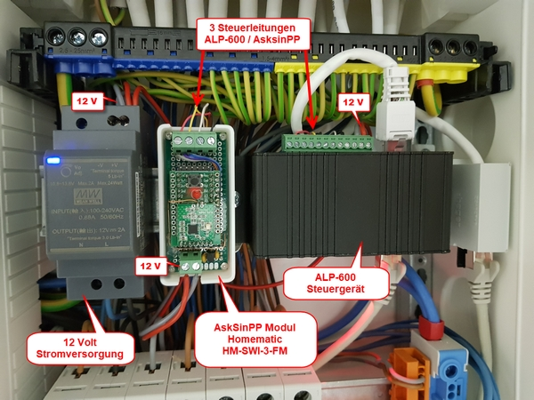
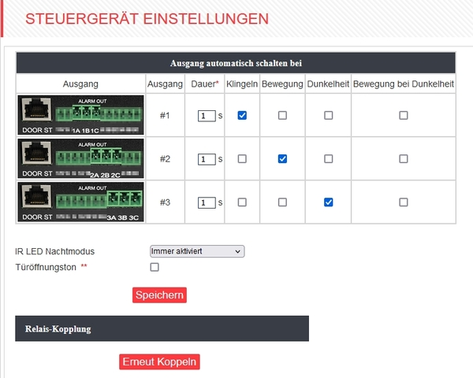

# WW-mySHP - 'Alphago ALP-600' Türsprechanlage im 'Homematic' Umfeld

[Zurück zur Übersicht ...](../README.md)

### Projekt-Beschreibung
Die 'Alphago ALP-600' Türsprechanlage bietet mannigfache Möglichkeiten zur Konfiguration und dem Cloud-losen Einsatz im privaten Bereich. Neben den Produkt spezifischen Eigenschaften der Türsprechanlage - [die hier nachgelesen werden können](http://alphago.de/Tuersprechanlage-Alphago-ALP-600xU-Unterputz/9266) - sollte die 'Alphago ALP-600' zusätzlich in der 'Homematic' Heimautomation Benachrichtigungen und Bilder / Videos zur Verfügung stellen.

### Allgemeiner Aufbau
Es wurde die Unterputzvariante der 'Alphago ALP-600' verbaut. Sie unterscheidet sich von der Aufputzvariante durch eine große Unterputzdose, die (hier) in das Mauerwerk eingelassen werden mußte und einer (Kunststoff-) Abdeckung, die das Kameramodul aufnimmt. In beiden Varianten muß eine Kabelverbindung von der Kamera zu dem Steuergerät gelegt werden (Kabellänge max. 20m) - das Steuergerät wird mit dem lokalen Netzwerk (hier: Fritzbox) verbunden.

Der Aufbau und die Konfiguration der 'Alphago ALP-600' wird nicht im Detail beschrieben - diese Informationen können der Dokumentation entnommen werden. 

### Original Dokumentation 'Alphago ALP-600'
- Dokumentation 'Alphago ALP-600' - Stand 02-2025 - [Zeigen ...](./bin/ALP-600_Doku_20250228.zip)

### Konfiguration 'Alphago ALP-600'
- Beispiel-Konfiguration (für Homematic) 'Alphago ALP-600' - Stand 12-2023 - [Zeigen ...](./bin/ALP-600_Einst_20231215.zip)

### 'Alphago ALP-600' - Hardware Lösung zur 'Homematic' Anbindung
Das Steuergerät der 'Alphago ALP-600' bietet drei Hardware-Ausgänge an, die mit den Kamera-Ereignissen 'Klingeln', 'Bewegung', 'Dunkelheit' und 'Bewegung bei Dunkelheit' über das WebGUI verknüpft werden können. An die drei Ausgänge wird ein Homematic Schaltsensor angeschlossen - im vorliegenden Fall wurde auf Basis von 'Asksin++' ein 'HM-SWI-3-FM' Modul gewählt, das drei Schaltzustände an die 'Homematic' Zentrale melden kann. Natürlich könnte hier auch jede andere HmIP Kontaktschnittstelle zum Einsatz kommen.

Die gesamte Einheit, bestehend aus 'Alphago ALP-600' Steuergerät, 'Meanwell 12 Volt / 2A' Netzteil und 'HM-SWI-3-FM' Modul, wurden im nahegelegen Schaltschrank untergebracht. Von dort geht das Netzwerkkabel zur Fritzbox, die sich in einem anderen Raum befindet. Optional könnte man die Stromversorgung auch über eine POE-Netzwerkverbindung laufen lassen, die mit einer USV verbunden ist - damit wäre die Türsprechanlage auch bei einem Stromausfall noch nutzbar.

In der 'Homematic' Zentrale stehen damit über das Gerät 'HM-SWI-3-FM' die Kamera Events direkt zur Auswertung zur Verfügung.

### 'Alphago ALP-600' - Software Lösung zur 'Homematic' Anbindung
Ganz ohne Hardware Erweiterung können Kamera-Ereignisse auch per HTTP-Event an die 'Homematic' Zentrale geschickt werden. Dazu müssen in den 'Alphago ALP-600' Einstellungen über das WebGUI entsprechende Einstellungen vorgenommen werden. Je nach Anforderung sind folgende drei Verknüpfungen möglich:

1. 'Homematic' Systemvariable als Flag durch 'ALP-600' HTTP-Event setzen - [Zeigen ...](./bin/ALP-600_1_HTTP_SysVar.txt)
2. 'Homematic' Programm über XML-API durch 'ALP-600' HTTP-Event ausführen - [Zeigen ...](./bin/ALP-600_2_HTTP_XML-Prog.txt)
3. 'Homematic' Systemvariable über XML-API durch 'ALP-600' HTTP-Event setzen - [Zeigen ...](./bin/ALP-600_3_HTTP_XML-SysVar.txt)

### Überblick
- 'Alphago ALP-600' - Vorbereitung zur Unterputz-Montage:
  

  
- 'Alphago ALP-600' - Unterputz-Montage:
  

  
- Schaltschrank Installation 'ALP-600' Steuergerät mit 'Homematic / Asksin++' Sendemodul 'HM-SWI-3-FM'
  

  
- 3D-Druck Gehäuse für 'Homematic / Asksin++' Sendemodul 'HM-SWI-3-FM'
  

  
- 'Homematic / Asksin++' Sendemodul 'HM-SWI-3-FM' auf Lochrasterplatine mit Spannungsregelung
  

  
- Spannungsregelung 3,3 Volt für 'Asksin++' Sendemodul
  

  
- Anschlußbelegung des 'Alphago ALP-600' Steuergeräts mit dem 'Homematic / Asksin++' Sendemodul 'HM-SWI-3-FM'
  

  
- 'Alphago ALP-600' Steuergerät - Konfiguration der Alarmausgänge
  

### 3D-Print
- 3D-Druck für 'HM-SWI-3-FM' Gehäuse - [Zeigen ...](./bin/HM_SWI_3_FM_Hutschiene_20210721.zip)

### Asksin++ - 'HM-SWI-3-FM'
- INO-Datei für 'HM-SWI-3-FM' - [Zeigen ...](./bin/HM_SWI_3_FM_ext_20210710.zip)

### Historie
- 2025-03-01 - Anpassungen
- 2021-11-18 - Erstveröffentlichung
