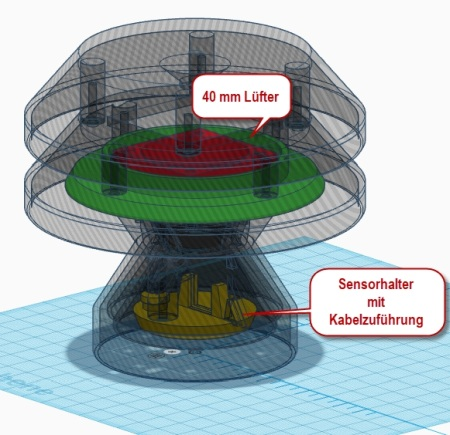

# WW-mySHP - BME-Shield - (Outdated)

[Zurück zur Übersicht ...](../README.md)

#### Projekt-Beschreibung

Universelle Wetterkappe für die Luftdruck-Sensormodule BME280 oder BMP280.

#### Details
- Der ursprüngliche Entwurf der Wetterkappe stammt von Dr. Eugen Stall:
  - https://www.stall.biz/produkt/wetterkappe-fuer-den-weatherman-neues-layout
  
- Basierend auf dieser Grundlage wurde eine erste Version einer Wetterkappe konstruiert und in einigen Punkten modifiziert und erweitert:
   - Vergrösserung der Sensorkammer
   - Erweiterung der Gehäuselüftung für die Sensorkammer
   - (verschiedene) Adapter zur Aufnahme des Sensors
   - eindeutige Fixierung der Kabelzuführung
   - zusätzliche Lüftungskappen (einfach / erweitert) zur geschützten Entlüftung der Sensorkammer
  
- Version 2.0 der Wetterkappe als Weiterentwicklung für eine bessere Durchlüftung der Sensorkammer - Testergebnisse sind im Weiteren aufgeführt.

- Version 3.0 der Wetterkappe wurde als ['YAWS Toolbox'](https://github.com/wolwin/WW-mySHP/blob/master/SHP_YAWS/README.md "Zeigen ...") fortentwickelt.

#### BME-Shield - Version 1.1
- ##### BME-Shield V 1.1 - Konstruktion
  - Passiv belüftete Wetterkappe
    
  
  
    
  
  

- ##### BME-Shield V 1.1 - 3D-Druck - Details
  - Sensorkammer V1.0 mit Lüftungskappen und Sensor-Adapter:
    
  
  
    
  - Beispiel der Kabelfixierung und des Sensor-Adapters (senkrecht):
    
  
    
  - Beispiel der Kabelfixierung und des Sensor-Adapters (geneigt):
    
  
    
  - Sensorkammer V1.0 und Sensor-Adapter (geneigt):
    
  
    
  - Sensorkammer V1.0 unten (geschlossen):
    
  

- ##### BME-Shield V 1.1 - 3D-Druck
  - BME-Shield V1.0 (einfach):
    
  
    
  - BME-Shield V1.0 (erweitert):
    
  
    
  - Wurde im Herbst und Winter 2018/2019 erfolgreich getestet:
    
  

- ##### Montagematerial:
  - 1 BME280
  - 1 PTFE Druckausgleich-Membran Ø10,2/5,5 VPE
  - 1 Blechschraube 3,5 x 13
  - 1 Zylinderschraube >= 4 x 35 + Unterlegscheibe mit Mutter 4 mm
  - Kabelbinder 2,5 mm
    
  

#### BME-Shield - Version 2.0
- ##### BME-Shield V 2.0 - Konstruktion
  - Aufwändig konstruierte Wetterkappe - einsetzbar mit oder ohne Lüfter
    
  
    
  
    
  
    
  - Erprobungszeitraum  vom Frühjahr 2019 bis Sommer 2020 mit und ohne Lüfter-Aktivierung, um die 'grundsätzliche' Funktionsfähigkeit des BME-Shields zu testen .

- ##### BME-Shield V 2.0 - 3D-Druck
  - Übersicht der 3D-Druckteile
    
  
    
  - Montage der Lüfterplatte mit Fixierbolzen (können auch weggelassen werden) und mit 4 Blechschrauben (Rundkopf 3,5x13mm):
    
  
    
  - Sensor mit PTFE Druckausgleichsmembran MITTIG abdecken
    
  
    
  - Membranhalter auf Platine wie im Bild gezeigt positionieren (STL 3D-Druckfile liegt im BIN-Verzeichnis) - dann die überstehenden Folienseiten um die Platine klappen und den Halter nach rechts über die Platinenkante drehen
    
  
    
  - Membranhalter bündig fixieren (Halter auf Platine drücken), sodass die Membran faltenfrei aufliegt:
    
  
    
  - Bei der Endmontage des Sensorträgers dafür sorgen, dass die Kabel in der Sensorkammer nicht die Seitenwände berühren (Feuchtigkeitsbrücke).
  - Evtl. beim Zusammenbau mit etwas Silikon sicherstellen, dass keine Feuchtigkeit über die zentrale Mutter von oben in das Gehäuse kommen kann.
  - Vormontage der Kabelfixierung und des Sensor-Adapters mit Membranhalter (Kabel: JY(St)Y 4x2x0,6) - auf der Weatherman-Seite wird das +5V und das Masse-Kabel direkt an den 5V Eingang / Masse angeschlossen:
    
  
    
  - Montage der Sensorplatine und Durchleitung der Stromversorgungsdrähte für den Lüfter - dabei sollte die Sensorplatine richtig positioniert sein - mittig, unten, keine Wandberührung - fixiert wird der Träger mit einer einzelnen Blechschraube (Rundkopf 3,5x13mm):
    
  
    
  
    
  
    
  - Montage des Lüfters mit 4 Blechschrauben (Rundkopf 3,5x19mm) und Unterlegscheiben - wahlweise kann (für Testzwecke) im Rand auch ein Ein/Aus Mikroschalter verbaut werden:
    
  
    
  - Zusammenbau der beiden Deckkappen mit 4 Blechschrauben (Rundkopf 3,5x13mm) - Deckkappen hier mit Alu-Reflexionsschutz - und Vormontage der Halterungsschraube in der obersten Kappe:
    
  
    
  - Montage der beiden Kappen und der Sensoreinheit mit 4 Blechschrauben (Rundkopf 3,5x13mm):
    
  

- ##### Montagematerial:
  - 1 BME280
  - 1 PTFE Druckausgleich-Membran Ø10,2/5,5 VPE
  - 1 40mm Lüfter NOCTUA NF-A4x10 5V
  - evtl. 1 Ein/Aus Mikroschalter
  - Kabel JY(St)Y 4x2x0,6 (Kupferadern)
  - 13 Blechschrauben 3,5 x 13
  - 4 Blechschrauben 3,5 x 19 und 4 Unterlegscheiben
  - Zylinderschraube >= 4 x 35 + Unterlegscheibe mit Mutter 4 mm
  - Kabelbinder 2,5 mm

- ##### Langzeiterfahrung:
  - Wetterkappe V 2.0 nach ca. einem Jahr im Dauerbetrieb (Sommer 2019 bis Sommer 2020)
    
  
    
  - Trotz hoher Verschmutzung ist der Noctua Lüfter nach 7/24 Betrieb voll funktionsfähig.
    
  
    
  - Hoher Verschmutzungsgrad der Sensorkammer im städtischen Umfeld.
    
  
    
  - Hoher Verschmutzungsgrad und Insektenbefall des Sensors - Auflösungserscheinungen der PTFE-Membran (Ausfall des BME280 Sensors nach einem Betriebsjahr !!!).
    
  

#### BME-Shield - Sonstiges
- #### Tipps:
  - Natürlich sollten alle 3D-Druckteile mit einem weissen UV-beständigen Acryl-Lack überzogen werden. Man kann natürlich Sprühlack einsetzen - aber: im Innenbereich nicht einsetzbar !! Gute Erfahrungen habe ich mit lösungsmittelfreien Streichlack gemacht - läßt sich mit einem kleinen Pinsel super verarbeiten ... und riecht (fast) nicht:
    
   400 ml&nbsp;&nbsp;&nbsp;&nbsp;&nbsp; 125 ml
    

- ##### BME280 Modul, PTFE-Druckausgleichsmembran, NOCTUA Lüfter:
  - Siehe hier:
    
  
    
  - BME280
    - https://www.az-delivery.de/search?type=article%2Cpage%2Cproduct&q=bme280*&ls=de
    
  - PTFE Druckausgleich-Membran Ø10,2/5,5 VPE
    - https://shop.bb-sensors.com/Messtechnik-je-Branche/Automotive/Druckausgleich-Membran-10-2-5-5-VPE-12-Stueck.html
    
  - NOCTUA NF-A4x10 5V
    - https://noctua.at/de/products/fan/nf-a4x10-5v

#### Historie
- 2020-07-05 - Umzug in SHP Bereich / Outdated Vermerk und Hinweis auf 'YAWS-Toolbox'
- Version 2.0 - 2018-05-10
  - Neue erweiterte Version
- Version 1.1 - 2018-12-22
  - Erhöhung der Spritzschuzkanten bei Sensorkammer und Deckeln
- Version 1.0 - 2018-12-19
  - Erstausgabe
