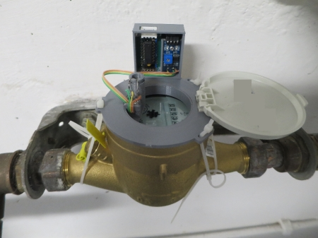
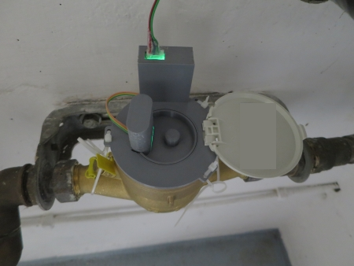

# WW-mySHP - Homematic Energiezähler für Gas, Wasser und Strom

[Zurück zur Übersicht ... ](../README.md)

### Projekt-Beschreibung
Registrierung der Zählerstände für Gas, Wasser und Strom mit der 'Homematic Zählersensor-Sendeeinheit 'HM-ES-TX-WM'. Die Zählersensor-Sendeeinheit ist das Kernstück des Energiezähler-Erfassungssystems von Homematic. Das Gerät stellt die Funk-Verbindung zwischen den Gas-, Strom-, Wasserzählersensoren des Systems sowie einer Zentrale ('CCU' oder 'RaspberryMatic') her und sorgt für die Anpassung an den jeweilig angeschlossenen Energiezähler
Für die folgenden Geräte wurden mit Hilfe von Breakout-Sensor-Modulen <b>_einfache 'proof-of-concept' Lösungen_</b> geschaffen:
- <b>Gaszähler 'Pipersberg G4-RF1'</b> mit der Spezifikation '1 Impuls = 0,01 m3'
- <b>Wasserzähler 'elster de-08-mi001-ptb 019'</b> mit der Mess-Auflösung 'x0001 m3'
- <b>Ferraris Tarifstromzähler 'Siemens Drehstromzähler'</b> mit der Spezifikation '75 Umdrehungen = 1 kWh'

### Allgemeiner Aufbau
Da sich im Laufe der Tests zeigte, dass es zu 'Überschwingungen' am Ausgang der benutzten Breakout-Sensor Modulen kam und damit falsche Zählimpulse generiert wurden, mußte noch ein nachgeschalteter Hardware 'Schmitt-Trigger' eingefügt werden, der korrekte Rechteck-Impulse erzeugt.

 Der 'Schmitt-Trigger' kann auf einer 40 x 20 mm Lochrasterplatine einfach selbst verdrahtet werden - oder aber es kann direkt eine einfache 38 x 15 mm PCB-Platine (THT) benutzt werden. Schaltung und Gerber-Dateien finden sich im PCB-Bereich - [Zeigen ...](https://github.com/wolwin/WW-myPCB/blob/master/PCB_Schmitt-Trigger_uni/README.md)

 Eingebaut wurde die HM-Sendeeinheit in ein 'OBO T40' Gehäuse mit Befestigungsteilen aus dem 3D-Drucker - [siehe 'OBO T40 für 'HB HomeBrew' Platinen'](https://github.com/wolwin/WW-my3DP/blob/master/3DP_OBO_T40_HB/README.md). Die Spannungsversorgung erfolgt über ein externes 12 Volt Steckernetzteil über 5,5 x 2,1 mm DC-Buchse / Stecker.

 

Platz für den Einbau eines 3-fach AA-Batteriehalters für eine optionale Stromausfallüberbrückung ist vorhanden.

### Platinen
- Platine 'Universelle 'AskSin++' Platine' - [Zeigen ...](https://github.com/wolwin/WW-myPCB/blob/master/PCB_HB-UNI-Sens-X/README.md)
- Platine 'Schmitt-Trigger uni' - [Zeigen ...](https://github.com/wolwin/WW-myPCB/blob/master/PCB_Schmitt-Trigger_uni/README.md)

### INO-Skript
Grundlage ist das 'Asksin++' Beispiel-Skript 'HM-ES-TX-WM_CCU' von Jérôme Pech:

- Original-Skript - [Zeigen ...](https://github.com/jp112sdl/Beispiel_AskSinPP/tree/master/examples/HM-ES-TX-WM_CCU)

Das Original-Skript wurde so angepaßt, dass alle möglichen Konfigurationsparameter nun in der Datei 'HM-ES-TX-WM_CCU_ext.h' ausserhalb des INO-Files zusammengefaßt wurden. So kann das Gerät 'HM-ES-TX-WM_CCU' individuell konfiguriert werden, ohne den zentralen Quelltext ändern zu müssen:

- Erweitertes Skript - [Download ...](./bin/HM-ES-TX-WM_CCU_ext_20230106.zip)

### Impulsgeber für Gaszähler 'Pipersberg G4-RF1'
 

Da zuerst nicht klar war, wie man das Zählwerk des Gaszählers 'Pipersberg G4-RF1' am besten auswerten kann, wurden folgende Tests durchgeführt:

  1. Reed-Kontaktgeber
    
  

  Funktioniert nicht, da der Reed-Sensor nicht direkt über der letzten, rechten Walze positioniert werden kann. Außerdem scheint die Magnetfeldstärke einfach zu gering zu sein, um den Reed-Sensor auszulösen.

  2. Abtastung des Spiegels in der Ziffer '6' in der letzten, rechten Walze des Gaszählers
    
  

  Mit einem 'TCRT5000-Breakout' konnte der Spiegelvorbeilauf auf der letzten Ziffernwalze ermittelt werden - dafür mußte das IR-Modul direkt auf der Plexiglasscheibe aufsitzen. Weiter muß unbedingt ein 'Schmitt-Trigger' nachgeschaltet sein, damit 'eindeutige' Ein-/Aus-Signale am Eingang des 'HM-ES-TX-WM' anliegen. Für die Einstellung der Hysterese (Anzeige über Signal-LED auf dem Breakout) mit dem Poti auf dem Breakout braucht man eine ruhige Hand und Geduld ...

  3. Abtastung des Magneten in der letzten, rechten Walze des Gaszählers
    
  

  Das 'Hallgeber-Breakout (KY-024 Linear Magnetic Hall Sensor - 49E)' konnte den Magnetvorbeilauf ermitteln - dafür mußte die Breakout-Platine ganz rechts hinten in der Zählerausbuchtung positioniert werden. Auch bei diesem Breakout mußte ein 'Schmitt-Trigger' nachgeschaltet werden. Die Einstellung der Hysterese mit dem Poti auf dem Breakout ist nicht so kritisch wie bei dem 'TCRT5000-Modul'.

Betrieben wurden 'TCRT5000-Breakout' und 'Hallgeber-Breakout (49E)' je eine Woche an einem 'Asksin++' Sende-Modul wie oben beschrieben mit der 'HM-ES-TX-WM_CCU' INO-Firmware. Beide Module ergaben identische Differenzwerte zur manuellen Zählerablesung - dh.: über den (kurzen) Zeitraum konnten keine Abweichungen (Dropouts) der Zählimpulse entdeckt werden.

Zusammenfassung:
- es ist keine Batterie betriebene Lösung mit einem Reed-Sensor an diesem Gaszähler-Typ möglich
- die Lösung 2 mit dem 'Hallgeber-Breakout' ist der 'TCRT5000-Breakout' Lösung vorzuziehen

Benutzte Breakout-Module von: www.az-delivery.de
- KY-033 Linienfolger Modul mit TCRT5000 und Analog-Ausgang
  - EAN 4260581554835
  - Infrarot-Reflexionssensoren TCRT5000
  - Komparator-Ausgang, Signal in Wellenform
  - Einstellbar mit Poti (LM393)
  - Betriebsspannung: 3,3 V - 5 V
  
- KY-024 Linear Magnetic Hall Sensor
  - EAN 4260581558932
  - Einstellbar mit Poti (LM393)
  - Betriebsspannung 3.3 V - 5 V

### Impulsgeber für Wasserzähler 'elster de-08-mi001-ptb 019'
 

Wie schon beim Impulsgeber für den Gaszähler zeigte sich, dass eine 'sichere' Abtastung der sich drehenden kleinen Zeiger der Wasseruhr mit dem 'TCRT5000-Breakout' auf Grund der dicken Plexiglasscheibe nicht funktioniert. Angelehnt an das Projekt [STALL.BIZ](https://www.stall.biz/project/impulsgeber-fuer-den-wasserzaehler-selbst-gebaut) wurde das 'TCRT5000-Breakout' modifiziert, indem die TCRT5000-LED-Einheit entfernt und durch eine grüne 3 mm LED und eine 5 mm Fotodiode ersetzt wurden. Um eine optimale Positionierung von LED und Fotodiode erreichen zu können, sitzen diese extern vom Breakout in einer speziellen Lochblenden-Konstruktion. Die Lochblende und die grün leuchtende LED (hell mit engen Abstrahlungswinkel) sorgt für einen definierten Kreis, durch den dann der rote Zeiger der Wasseruhr fährt und damit eine Spannungsänderung am Fototransistor auslöst. Auch hier wurde ein invertierender 'Schmitt-Trigger' nachgeschaltet.

  

Folgende Modifikationen am 'TCRT5000-Breakout' müssen durchgeführt werden:

  

Zusammenbau der 3D-Druckteile und Fixierung mit 2,5 mm Kabelbindern:

  

  

  

- Benutzte LED von: www.kt-micro.de
  - LED 30GR-E10
    - 3 mm rund
    - grün ultrahell 12000 mcd
    - Allgemeine Eigenschaften:
      - Bauform: 3 mm standard
      - Pin Abstand: 0,1" / 2,54 mm
      - Betriebstemperatur: -25 - 85°C
    - Elektrische Eigenschaften:
      - Flußspannung: 2,9 - 3,2 V
      - max. Strom: 20 mA
    - Optische Eigenschaften:
      - Farbe: grün
      - Wellenlänge: 525 nm
      - Helligkeit: 12000 mcd
      - Linse: wasserklar
      - Abstrahlwinkel: ca. 30°
  
- Benutzte Fotodiode von: www.pollin.de
  - Fototransistor Everlight PT333-3C (Bestellnr. 131490)
    - Tageslicht und Infrarot
    - 5 mm rund
    - EAN: 4049702167846
    - Technische Daten:
      - Wellenlänge (50%-max-50%): 400-940-1100 nm
      - Empfindlichkeit: 0,7 … 4,0 mA … 7,1 mA @ 1 mW/cm², VCE= 5 V
      - Öffnungswinkel: k.A.
      - VCE max: 30 V
      - VEC max: 5 V
      - IC max: 20 mA
      - IC off: 100 nA @ VCE=20 V
      - tr: 15 µsec
      - tf: 15 µsec
      - PV max: 75 mW @ 25 °C
      - Temp. Bereich: -25 … 85 °C
      - Gehäuseform: T-1
      - Montage: THT

### Impulsgeber für Ferraris Tarifstromzähler 'Siemens Drehstromzähler'
Auch für den Tarif-Stromzähler kann das modifizierte 'TCRT5000-Breakout' benutzt werden. Trotz einer schwarzen (statt einer roten) Markierung auf der Ferraris Scheibe werden die Impulse korrekt erkannt. Als Befestigung wird ein 3D-Druck Rahmen benutzt, der die Lochblende zentriert über der Ferraris Scheibe fixiert. Die Konstruktion wird vom [Small Ball Mounting System](https://www.thingiverse.com/thing:4632571) gehalten - die hier benötigten Teile sind im 3D-Druck Archiv für den Tarif-Stromzähler enthalten.

  

### 3D-Print
- 3D-Druck für Gaszähler 'Pipersberg G4-RF1' - [Zeigen ...](https://github.com/wolwin/WW-my3DP/blob/master/3DP_EZ_GWS/README.md)
- 3D-Druck für Wasserzähler 'elster de-08-mi001-ptb 019' - [Zeigen ...](https://github.com/wolwin/WW-my3DP/blob/master/3DP_EZ_GWS/README.md)
- 3D-Druck für Ferraris Tarifstromzähler 'Siemens Drehstromzähler' - [Zeigen ...](https://github.com/wolwin/WW-my3DP/blob/master/3DP_EZ_GWS/README.md)

### Historie
- 2023-04-13 - Ergänzung Schaltung Stromausfallüberbrückung
- 2023-01-14 - Erstveröffentlichung
