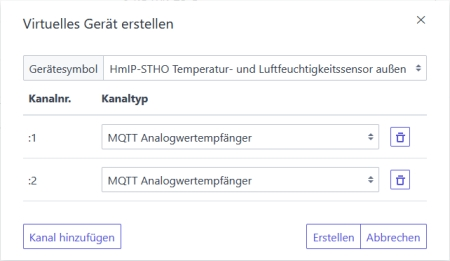

# WW-mySHP - 'AI-on-the-edge-device' Energiezähler für Gas, Wasser und Strom im Homematic Umfeld

[Zurück zur Übersicht ...](../README.md)

### Projekt-Beschreibung
Das Github Projekt ['AI-on-the-edge-device'](https://github.com/jomjol/AI-on-the-edge-device}) ermöglicht, analoge Wasser-, Gas-, Strom- und andere Zähler mit billiger und leicht verfügbarer Hardware (ESP-32 CAM) zu digitalisieren. Der Einsatz und die Integration solcher Auslesegeräte im Homematic Umfeld wird hier skizziert und erläutert.

Aufbau, Hardware und Konfiguration sind den Github Projekt Seiten zu entnehmen:

['AI-on-the-edge-device' - Dokumentation](https://jomjol.github.io/AI-on-the-edge-device-docs/)<br>
['AI-on-the-edge-device' - Diskussion](https://github.com/jomjol/AI-on-the-edge-device/discussions)

An dieser Stelle möchte ich ausdrücklich auf die fantastische Arbeit des Autors [jomjol](https://github.com/jomjol) hinweisen: sie verdient Respekt und Anerkennung !!

### Projekt-Umfeld
Für die folgenden Zähler wurden entsprechende Gehäuse und Halterungen zur Aufnahme des ESP-32-CAM Moduls konstruiert und dann ine Homematic Integration vorgenommen:
- <b>Gaszähler 'Pipersberg G4-RF1'</b> mit der Spezifikation '1 Impuls = 0,01 m3'
- <b>Wasserzähler 'elster de-08-mi001-ptb 019'</b> mit der Mess-Auflösung 'x0001 m3'
- <b>Ferraris Tarifstromzähler 'Siemens Drehstromzähler'</b> mit der Spezifikation '75 Umdrehungen = 1 kWh'

### Übersicht
Das 'AI-on-the-edge-device' benutzt zur Kommunikation die WLAN Schnittstelle. Während über eine GUI-Oberfläche alle Konfigurationen und Einstellungen vorgenommen werden können, bieten 'MQTT'-, 'REST API'- und 'Influx DB'-Schnittstellen einen automatisierten Zugang zu den anfallenden Ablesedaten des Moduls.

Hier bietet sich für die Verknüpfung der 'AI-on-the-edge-device' Welt mit der 'Homematic' Welt das MQTT-Protokoll an. Dazu muß auf der Homematic Zentrale das Addon ['CCU-Jack'](https://github.com/mdzio/ccu-jack) installiert werden. Das Addon bietet einen einfachen und sicheren REST- und MQTT-basierten Zugriff auf die Datenpunkte der Zentrale (CCU). Auch werden virtuelle Geräte in der CCU unterstützt - diese bieten eine nahtlose Integration in die Bedien- und Beobachtungsoberfläche der CCU und können in CCU-Programmen wie reale Geräte abgefragt und gesteuert werden. Damit können u.a. MQTT-Daten aus Fremdsystemen oder -geräten abgefragt oder an diese übertragen werden.

['CCU-Jack' - Anwenderhandbuch](https://github.com/mdzio/ccu-jack/wiki)

Auch hier möchte ich ausdrücklich auf die fantastische Arbeit des Autors [mdzio](https://github.com/mdzio) hinweisen: sie verdient ebenfalls Respekt und Anerkennung !!

Über die MQTT-Schnittstelle stellt das 'AI-on-the-edge-device' als MQTT-Client dem MQTT-Server 'CCU-Jack' auf der Homematic Zentrale MQTT-Topics zur Verfügung, die dann dort ausgewertet werden können.

### Allgemeiner Aufbau
Vorbereitend wird vorab das 'CCU-Jack' Addon je nach Systemumgebung [heruntergeladen](https://github.com/mdzio/ccu-jack/wiki/Download) und auf der Homematic Zentrale [installiert, sowie die notwendigen Konfigurationen](https://github.com/mdzio/ccu-jack/wiki/Installation-AddOn) vorgenommen.

Dann kann das (erste) 'AI-on-the-edge-device' Modul vorbereitet werden ... [siehe hier ...](https://jomjol.github.io/AI-on-the-edge-device-docs/Installation/). Dabei wird das Modul u.a. auch im eigenen WLAN angemeldet und am besten mit einer festen, lokalen IP-Adresse integriert. Als Hostname in 'WLAN.ini' wird 'AI-Wasser', 'AI-Gas', 'AI-Strom' (Standardstromzähler) bzw. 'AI-TStrom' (Tarifstrom mit HT- und NT-Zählern) eingetragen. Bei der erstmaligen Konfiguration im GUI sollten einfach immer die Default-Werte übernommen werden.

Hat man das 'AI-on-the-edge-device' Modul in Betrieb genommen - d.h.: man kann das Modul über das WLAN ansprechen und die Konfiguration schreiben und booten - dann geht es darum das Modul mit der Kamera am Zähler zu positionieren und anzubringen, sowie die ESP-32 Kamera auf das Zählerfeld zu fokusieren.

... und das ist eindeutig der schwierigste Teil des Projektes, den man zeit- und nervenmäßig nicht unterschätzen sollte!! Während es für Wasserzähler jede Menge 3D-Druckvorlagen oder sonstige Befestigungen gibt, die eine einfache Montage des 'AI-on-the-edge-device' Moduls gewährleisten, wird es dann schwierig, wenn beengte Platzverhältnisse besondere Lösungen notwendig machen - siehe unten: Gas- und Stromzähler ...

Besonders kritisch bei ALLEN mir bekannten Installationen (... und ich habe gefühlt alle Beschreibungen im Internet nach einer Lösung durchforstet ...) sind die Reflexionen der Plexiglasscheibe des Zählers, die durch die Beleuchtung des Zählerfeldes entstehen. Während man bei einer runden Wasseruhr das Reflexionslicht noch in einen unbenutzten Bereich 'wegdrehen' kann, geht das bei feststehenden Halterungen nicht mehr. Alle Tipps mit Abdunklung im Bereich der Reflexion durch schwarzes Klebeband oder schwarze Pappe oder auch externe LED Beleuchtung, o.ä. mögen im einzelnen Fall vielleicht funktionieren ... sie erfordern jedoch Zeit und Ausdauer, wenn es nicht direkt funktioniert.
<br>Beispiele dazu siehe Bilder unten ... Gaszähler: Reflexion von interner Beleuchtungs-LED, Wasserzähler: Reflexion 'weggedreht', Stromzähler: zwei externe LEDs, deren Reflexionspunkte mit schwarzem Klebeband abgedeckt sind.

Am Anfang mag etwas seltsam klingen, aber es hat sich im Dauerbetrieb gezeigt, dass es wichtig ist, eine stabile und feste Konstruktion für die Aufnahme des ESP-32 Moduls zu bauen - das gilt besonders auch für die Fixierung des Moduls in seinem Halter (... Heißkleber ...)! Schon winzige Bewegungen führen dazu, dass die mühsam vorgenommene ROI-Justierung wertlos wird. Ergebnis sind fehlerhafte Ablesungen.<br>
Erst wenn die hardwareseitigen Voraussetzungen gegeben sind und funktionieren, sollte man sich an die 'endgültige' Konfiguration des 'AI-on-the-edge-device' Moduls begeben.

Hier die im Projekt erstellten Gehäuse für gas, Wasser und Strom:

  - <b>'AI-on-the-edge-device' für Gaszähler 'Pipersberg G4-RF1'</b>
    <br>Auf Grund beengter Platzverhältnisse wurde mit Hilfe eines 45 Grad Umlenkspiegels eine vertikale Anordnung der Ableseeinheit kostruiert. Sie besteht aus insgesamt fünf Teilen, die spielfrei ineinander geclipst werden können. Das ganze wird über eine integrierte Halterung, die in die dafür vorgesehene Buchse im Gehäuse gesteckt wird, mit dem Gaszähler verbunden.
    <br><br>
    <br><br>

  - <b>'AI-on-the-edge-device' für Wasserzähler 'elster de-08-mi001-ptb 019'</b>
    <br>Für den Wasserzähler wurde die bekannte Tubus Standardlösung gewählt. Ein speziell konstruierter Halter, der durch drei Kabelbinder und die Klappmechanik der Wasseruhr gehalten und fixiert wird, bietet sicheren Halt auf der Wasseruhr. Der Tubus selber besteht aus einem DN75 Abwasserrohr. Darauf sitzt der drehbare Deckel mit der ESP-32 Halterung.
    <br><br>
    <br><br>

  - <b>'AI-on-the-edge-device' für Ferraris Tarifstromzähler 'Siemens Drehstromzähler'</b>
    <br>In dem 'alten' Schaltschrank sind die Platzverhältnisse noch schwieriger. Außerdem handelt es sich hier um einen Tarifzähler, bei dem zwei Zählwerke abgelesen werden müssen. Die aufwendige Konstruktion benutzt ebenfalls einen 45 Grad Umlenkspiegels für eine vertikale Anordnung der Ableseeinheit - zwei externe LEDs sorgen für eine ausreichende Beleuchtung. Die Konstruktion besteht aus acht einzelnen Teilen, die spielfrei ineinander geclipst werden können. Gehalten wird die Einheit vom [Small Ball Mounting System](https://www.thingiverse.com/thing:4632571) - die hier benötigten Teile sind im 3D-Druck Archiv für den Tarif-Stromzähler enthalten.
    <br><br>
    <br><br>

### Konfiguration 'AI-on-the-edge-device'
Hat man eine stabile Hardware Installation aufgebaut, kann man an das Feintuning gehen - im Wiki findet man die [Details zu den Justiereinstellungen](https://jomjol.github.io/AI-on-the-edge-device-docs/Reference-Image/). Hier die wesentlichen Abläufe:<br>
- Zuerst wird das Referenz-Bild (die Bild-Ausrichtung) des Zählers eingestelt: unter 'SETTINGS / ALIGNMENT / REFERENCE IMAGE' können auch die LED Beleuchtungsstärke und die Bildparameter Helligkeit, Kontrast und Sättigung (nur wenn die interne ESP-32 LED benutzt wird). Mit dem 'Save' Knopf werden die Einstellungen abgespeichert.<br>
- Dann werden Ausrichtungsmarkierungen aktualisiert: unter 'SETTINGS / ALIGNMENT / ALIGNMENT MARKS' werden zwei markante Bildbereiche für 'Reference 0' und 'Reference 1' ausgewählt und jeweils mit dem 'Save' Knopf abgespeichert.
- Zuletzt kommt der wichtigste Punkt - es werden die anlogen und/oder die digitalen 'Regions Of Interest' definiert: unter 'SETTINGS / REGIONS OF INTEREST / DIGITAL ROIs' bzw. 'SETTINGS / REGIONS OF INTEREST / ANALOG ROIs'. Detailierte Angaben dazu [finden sich wieder im Wiki](https://jomjol.github.io/AI-on-the-edge-device-docs/ROI-Configuration/) ...
  - Für Tarifstromzähler müssen zwei Zahlenreihen ausgewertet werden. Dafür wird auf der Seite 'Digit ROI's' der 'Number'-Eintrag 'main' in 'HT' umbenannt. Zusätzlich wird ein neuer ROI mit dem Namen 'NT' angelegt. Dann werden die beiden Ziffernfolgen für den jeweiligen 'HT'- bzw. 'NT'-Bereich definiert und abgespeichert.
- Abschließend wird das ESP-32 Modul gebootet.

Nach dem Neustart sollten nun schon erste Auslese Ergebnisse in der GUI Oberfläche sichtbar werden. Unter 'SETTINGS / CONFIGURATION' kann das 'AI-on-the-edge-device' fein justiert werden. Besonders die Einträge ['Digital / Model' und/oder 'Analog / Model'](https://jomjol.github.io/AI-on-the-edge-device-docs/Choosing-the-Model/) bestimmen die Auslese Ergebnisse.

Unter dem Punkt 'MQTT' kann die Verbindung zur Homematic CCU mit dem 'CCU-Jack' Addon hergestellt werden (beachten: Firewall-Portfreigabe auf der CCU - hier Port 1883):

```
      - 'MQTT' - checked
        - 'URI'   
          - mqtt://IP-CCU:1883<br>
        - optional: 'Client ID', 'Username', 'Password'
        - 'Main Topic' je nach Zählertyp
          - AI-Wasser
          - AI-Gas
          - AI-Strom
          - AI-TStrom
        - 'MQTT Retain Flag'
          - false
        - 'Meter Type' je nach Zählertyp
          - Watermeter ...
          - Gasmeter ...
          - Energymeter ...
```

Nach vielfachen MQTT-Ausgabetests mit der V13.x und V14.x von 'AI-on-the-edge-device' bezüglich der Bildauswerte-Konsistenz und der möglichen Einschränkungen bei fehlerhaft ermittelten Werten, ist festzustellen, dass natürlich kein durchgreifender AI-Algorithmus eine stetige Zahlenfolge generiert, sondern dass es bei der Mustererkennung der digitalen Ziffern immer wieder zu Fehlern kommt. Auch der Autor hat in seinem Wiki vermerkt, dass es zu Fehlern kommen kann. Und richtig: mit einem Blick auf die Zahlenfolge mit einem Ausreißer erkennen wir sofort den Fehler ... ein ESP-32 hat da aber schon genug mit der Mustererkennung zu tun. Eine sinnvolle Fehlerminimierung bei der Erfassung ist einfach nicht möglich und sinnvoll. Um einen kontinuierlichen MQTT-Datenstrom zu erhalten (Default: im 3 Minuten Raster), wurden daher alle optionalen Fehlerkorrektuern bzw. -einschränkungen ausgeschaltet. Das Postprocessing der Zählerwerte wird auf die Homematic Zentrale verlagert - dort prüft ein CCU-Skript, ob die eingehenden MQTT-Zählerwerte konsistent sind.

```
      - 'PostProcessing'
        - 'Previous Value'
          - false

        - 'Postprocessing Individual Parameters'
          - main
          oder für TStrom (folgende Punkte je Eintrag konfigurieren)
          - HT
          - NT

          - 'Allow Negative Rates'
            - true
          - 'Decimal Shift' - checked - je nach Zählertyp
            - 0 (Wasser)
            - -3 (Gas)
            - -1 (Strom)
            - -1 (TStrom)
          - 'Analog/Digital Transition Start' - checked
            - 9,2
          - 'Maximum Rate Value' - not checked
            - (0,5)
          - 'Maximum Rate Type' - not checked
            - (Absolute change)
          - 'Extended Resolution'
            - false
          - 'Ignore Leading NaNs'
            - false
```

Nach einem ESP-32 Reboot werden alle gespeicherten Einstellungen angwendet. Mit Hilfe des ['REST API'](https://jomjol.github.io/AI-on-the-edge-device-docs/REST-API/) können verschiedene Informationen des 'AI-on-the-edge-device' über einen Browser abgerufen werden.

- Beispiel: mit '*IP-AI-Modul/json*' erhält man die aktuellen Ergebnisse im JSON-Format:

  ```
  {
  "main":
    {
      "value": "14299.687",
      "raw": "14299.687",
      "pre": "14299.687",
      "error": "no error",
      "rate": "0.005000",
      "timestamp": "2023-03-23T15:03:23+0100"
    }
  }
  ```

### Konfiguration Homematic
Mit dem installierten 'CCU-Jack' Addon werden die vom 'AI-on-the-edge-device' versandten MQTT Nachrichten über den Port 1883 der Homematic Zentrale entgegengenommen - der 'CCU-Jack' arbeitet dabei als MQTT-Server. Das bedeutet, dass man schon zu diesem Zeitpunkt alle Topics eines 'AI-on-the-edge-device' abonnieren (Subscribe) kann.

  ```
  JSON Beispiele für die verschiedenen Zählertypen:

  AI-Gas/main/json
  AI-Wasser/main/json
  AI-Strom/main/json
  AI-TStrom/HT/json
  AI-TStrom/NT/json
  ```

Um die vom 'AI-on-the-edge-device' übermittelten Werte innerhalb der Homematic Umgebung nutzen zu können, bietet der 'CCU-Jack' die Möglichkeit virtuelle Geräte einzurichten - diese können in der CCU wie reale Geräte abgefragt und gesteuert werden.

  - Im 'CCU-Jack' unter dem Menüpunkt 'Virtuelle Geräte' wird ein neues Gerät mit dem Gerätesybol 'HmIP-STHO' angelegt. Für den Kanal 1 wird der Kanaltyp 'MQTT Analogwertempfänger' ausgewählt. Mit diesen Einstellungen können die MQTT-Werte der Zählertypen 'AI-Wasser', 'AI-Gas' und 'AI-Strom' empfangen werden.
  <br><br>

  - Für den Zählertyp 'TStrom' (Tarifstrom) wird zusätzlich Kanal 2 mit dem Kanaltyp 'MQTT Analogwertempfänger' angelegt.
  <br><br>

  - Mit 'Kanal hinzufügen' wird das virtuelle Gerät erzeugt und in 'Einstellungen / Geräte - Posteingang' der Homematic Zentrale abgelegt. Das neue Gerät wird übernommen und kann dann unter 'Einstellungen / Geräte' umbenannt und konfiguriert werden.
  <br><br>

  - Für die spätere Software Auswertung wird der Gerätename 'HmIP-STHO-JACKxxxx' geändert und mit der Namenskennung '_ZS-Gas', '_ZS-Wasser', '_ZS-Strom' oder '_ZS-TStrom' versehen (ZS = Zählersensor). Der vordere Namensteil - z.B. '0-KG_WK' - ist beliebig - die Abkürzung bedeutet hier: 'Kellergeschoss - Waschküche'.

  - Jetzt wird die MQTT-Verbindung zu dem 'CCU-Jack'-Analogwert Gerät hergestellt ('Einstellen' Knopf des Geräts in der Geräteliste). In der ersten Variante könnte man den MQTT-Wert direkt auslesen und konfigurieren, indem man nur das 'value' Topic benutzt (bitte nicht benutzen - steht hier nur zur Vollständigkeit):

    ```
    - ANALOG_INPUT_TRANSMITTER|TOPIC  -  je nach Zählertyp
      - AI-Gas/main/value
      - AI-Wasser/main/value
      - AI-Strom/main/value
      - AI-TStrom/HT/value
      - AI-TStrom/NT/value
    - ANALOG_INPUT_TRANSMITTER|PATTERN
    - ANALOG_INPUT_TRANSMITTER|EXTRACTOR
      - AFTER
    - ANALOG_INPUT_TRANSMITTER|REGEXP_GROUP
      - Werteingabe 0
    ```

  - Das funktioniert jedoch nur, wenn das 'AI-on-the-edge-device' keinen Fehler meldet. Bei einem Fehlerstatus ist das 'value' Topic leer und der 'CCU-Jack' Analogwertempfänger kann diesen Leerstring nicht verarbeiten. Daher muß der MQTT-Wert über ein JSON TEMPLATE ausgelesen werden. Das Template überprüft den Fehlerstatus: steht der Fehlerstatus auf 'no error' wird der 'value' Wert übernommen, andernfalls wird im Fehlerfall ein Wert '0' gesetzt.

    ```
    - ANALOG_INPUT_TRANSMITTER|TOPIC  -  je nach Zählertyp
      - AI-Gas/main/json
      - AI-Wasser/main/json
      - AI-Strom/main/json
      - AI-TStrom/HT/json
      - AI-TStrom/NT/json
    - ANALOG_INPUT_TRANSMITTER|PATTERN
      - {{with parseJSON .}}{{if eq .error "no error"}}{{.value}}{{else}}0{{end}}{{end}}
    - ANALOG_INPUT_TRANSMITTER|EXTRACTOR
      - TEMPLATE
    ```

  - Nach der Konfiguration des virtuellen 'CCU-Jack' Geräts finden diese sich in der 'CCU-Jack' Oberfläche:
  <br><br>

  - Und in der Geräteliste der Homematic Zentrale:
  <br><br>

### Homematic-Anwendung
Wie schon anfangs erwähnt, sind die übermittelten Gerätewerte des 'AI-on-the-edge-device' nicht fehlerfrei. Es können sich teils längere Zeitabschnitte ergeben, in denen immer wieder ein falscher Zahlenwert ermittelt wird.

- Stetiger Kurvenverlauf 'AI-on-the-edge-device' Gas Zähler:
  <br><br>

- Kurvenverlauf mit sieben Fehlablesungen 'AI-on-the-edge-device' Gas Zähler:
  <br><br>

Eine *direkte* Auswertung der gelieferten Zahlenwerte - z.B. für die Verbrauchs- und Kostenberechnung - ist daher m.E. nicht sinnvoll. Es wurde daher eine gemeinsame Skript-Funktion für alle Zählertypen entwickelt, die versucht, den korrekten Wert aus dem letzten Ablesewert, dem Zeitintervall und dem relativen Maximalverbrauch zu ermitteln.

### Homematic-Skripte
Im Rahmen der Evaluierung, welches die beste Methode ist, um Gas-, Wasser- und Stromzähler auszulesen, sind mehrere Homematic Skripte entstanden. Sie sind weitgehend konfigurierbar und universell einsetzbar.

- Skript 'Universelle Zählerstandberechnung für Gas Wasser, Strom' - [Zeigen ...](https://github.com/wolwin/WW-mySHT/blob/master/SHT_EZ-Script/README.md)
- Homematic Prüf-Skript für 'AI-on-the-edge-device' Energiezähler - [Zeigen ...](https://github.com/wolwin/WW-mySHT/blob/master/SHT_EZ-Script_AI/README.md)

### 3D-Print
- 3D-Druck für Gaszähler 'Pipersberg G4-RF1' - [Zeigen ...](https://github.com/wolwin/WW-my3DP/blob/master/3DP_EZ_GWS_AI/README.md)
- 3D-Druck für Wasserzähler 'elster de-08-mi001-ptb 019' - [Zeigen ...](https://github.com/wolwin/WW-my3DP/blob/master/3DP_EZ_GWS_AI/README.md)
- 3D-Druck für Ferraris Tarifstromzähler 'Siemens Drehstromzähler' - [Zeigen ...](https://github.com/wolwin/WW-my3DP/blob/master/3DP_EZ_GWS_AI/README.md)

### Historie
- 2023-03-23 - Erstveröffentlichung
