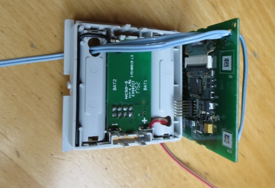
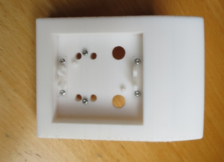
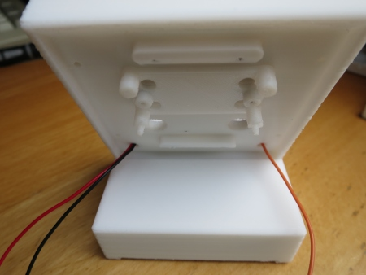

# WW-mySHP - HB‑Dis‑WM55‑Pb

[Zurück zur Übersicht ...](../README.md)

#### Projekt-Beschreibung

Projekt 'HB‑Dis‑WM55‑Pb - Erweiterung der Homematic 'Funk-Statusanzeige HM-Dis-WM55' zur externen zusätzlichen Ansteuerung der Anzeige-Tasten'.

Das Projekt basiert auf einer Veröffentlichung im FHEM-Forum:
['Antw:HomeMatic Funk-Statusanzeige - HM-Dis-WM55' - Antwort #283 am: 17 Mai 2015, 22:00:27 von hoover123](https://forum.fhem.de/index.php?topic=29128.msg295509#msg295509)

Ziel des Projektes war es, die Möglichkeiten des Homematic 'HM-Dis-WM55' Moduls auszuloten. Dabei stellte sich schnell heraus, dass es keine Möglichkeit gibt, die OLED-Anzeige bei einer Nachricht über die CCU Zentrale zu aktivieren - es ist immer ein Tastendruck zur Aktivierung des OLED-Bildschirms notwendig. Die im WebGUI der CCU Zentrale dargestellten Taster des 'HB-Dis-WM55' Moduls lösen keine Aktion aus, sondern dokumentieren nur den Zeitpunkt einer Aktion am OLED-Modul.
  
'hoover123' aus dem FHEM-Forum hatte die Idee, einen Tastendruck über einen zusätzlichen Schaltaktor 'HM-LC-SW1-BA-PCB' am 'HM-Dis-WM55' OLED-Modul zu simulieren.
  
Diese Idee wurde aufgegriffen und weiterentwickelt. Eine eigene 'Asksin++' Platine 'HB-Dis-WM55-Pb' in Verbindung mit dem 'HM-Dis-WM55' OLED-Modul ermöglicht nun das Betätigen der beiden Taster für je einen kurzen oder langen Tastendruck, gesteuert über die CCU Zentrale.
  
Damit kurze und lange Tastendrucke zuverlässig umgesetzt werden, wurde für das 'Asksin++' Modul ein speziell angepaßtes INO-Script geschrieben - hier wird sichergestellt, dass hardwaremäßig ein kurzer oder ein langer Tastendruck das 'HB-Dis-WM55' Modul erreicht. Das 'Asksin++' Modul wird als 'HM-LC-SW1-BA-PCB' Gerät mit vier Schaltkanälen in der CCU Zentrale geführt.

Die Ansteuerung eines Tastenndrucks sollte nicht im Direktmodus des WebGUIs über 'Status und Geräte / Geräte' am 'HM-LC-SW1-BA-PCB' Gerät erfolgen, da es sich ja eigentlich um einen Schaltaktor handelt - d.h.: drückt man für einen Kanal die Taste 'EIN', wird zwar der kurze bzw. lange Tastenimpuls am 'WM-Dis-WM55' ausgelöst, aber die Taste des 'HM-LC-SW1-BA-PCB' Geräts wird in der WebUI nicht zurückgesetzt und bleibt auf 'EIN' stehen!!

Stattdessen muss die Ansteuerung eines Tastendrucks per CCU Programm erfolgen, indem man den gewünschten Kanalschalter für 1 bzw. 2 sec einschaltet.

 | **Kanal** | **Tastendruck** | **Modus** |
 | --- | --- | --- |
 | 1 | Taste oben | kurz  |
 | 2 | Taste oben | lang |
 | 3 | Taste unten | kurz |
 | 4 | Taste unten | lang |

Hier exemplarisch alle vier Möglichkeiten als CCU Programm, ausgelöst über virtuelle BidCoS-RF-Taster:
  

  

  

  

  
Durch diese Kombination von INO-Script (Hardware) und CCU Zentrale 'EIN'/'AUS' Schalter als Impulsgeber, wird sichergestellt, dass der Tastenimpuls immer mit _'korrekter Zeitlänge'_ am 'HM-Dis-WM55'-Modul durchgeführt wird - eine evtl. Auslastung der CCU spielt damit für den Tastenimpuls 'kurz/lang' keine Rolle mehr!

Damit kann das 'HB-Dis-WM55' Modul nun auch bidirektional eingesetzt werden.

_Anmerkung:_
 
An dieser Stelle muss jedoch gesagt werden, dass eigentlich das Homematic 'WM-Dis-WM55' Modul sich nicht für die Darstellung von _sehr vielen Nachrichten_ eignet. Neben der begrenzten Display-Darstellung, ist es besonders der nach oben schnellende DutyCycle, der bei mehreren Meldungen oder eigenen Tast-Aktionen am Display, das m.E. ausschließen.

Jedoch können 'einfache' Meldungen, wie 'offene Fenster und Türen' beim Verlassen des Hauses, nun schnell und einfach über die CCU Zentrale an das Homematic 'HM-Dis-WM55' OLED-Display  ausgegeben werden.

#### Platine
- 'Asksin++' Platine 'HB‑Dis‑WM55‑Pb - V1.1' - [Zeigen ...](https://github.com/wolwin/WW-myPCB/blob/master/PCB_HB-Dis-WM55-Pb/README.md)

#### INO-Script
- 'HM_LC_SW1_BA_PCB_PB' INO-Script für 'Asksin++' Platine 'HB‑Dis‑WM55‑Pb' - [Download ...](./bin/HM_LC_SW1_BA_PCB_PB_20201007.zip)

- Alle wichtigen Informationen zu 'AskSin++' findet man auf der 'AskSin++'-Side - [Zeigen ...](https://asksinpp.de/)

#### 3D-Print
- 3D-Druck Projekt für 'HB‑Dis‑WM55‑Pb' - [Zeigen ...](https://github.com/wolwin/WW-my3DP/blob/master/3DP_HB-Dis-WM55-Pb/README.md)

#### Bilder
- Auszug 'HM‑Dis‑WM55' Schaltplan mit den herausgeführten Anschlüssen zur Zusatzplatine 'HB‑Dis‑WM55-Pb'
- Siehe auch Schaltplan im PCB-Bereich - [Zeigen ...](https://github.com/wolwin/WW-myPCB/blob/master/PCB_HB‑Dis‑WM55‑Pb/README.md#schaltplan)
    
  
    
- Vorderseite 'HM‑Dis‑WM55' OLED-Dislay Platine mit angelöteten Schaltdrähten (hier sind noch vier Adern verbunden ... es reichen auch drei Adern - siehe Schaltbild).
    
  
    
- Das Anlöten der Drähte an die Taster sollte in jedem Fall vor dem Einbau des OLED-Displays erfolgen. Es ist auf eine ausreichende Länge der Drähte zu achten, damit man später das OLED-Modul aus dem Gehäuse nehmen zu können, um z.B. den Modul-Konfigurationsknopf zu drücken!! Dann mit Heißkleber die Kabellötungen fixieren.
    
  
    
- Rückseite 'HM‑Dis‑WM55' OLED-Dislay Platine mit durchgeführten Schaltdrähten. Alternativ könnten auch hier die Anschlüsse angelötet werden.
    
  
    
- An die Batteriebleche der Sendemodul-Platine wird ein zweiadriges Kabel für die Spannungsversorgung angelötet. Ebenfalls auf ausreichende Kabellängen achten!
    
  
    
- Das Sendemodul wird in das mit Kabeldurchführungen aufgebohrte Batterie-Gehäuse eingebaut - siehe die beiden (ovalen) Löcher in den Batteriefächern. Darauf achten, dass die Stromversorgungskabel nicht 'auftragen', sondern 'vertieft' herausgeführt werden.
    
  
    
- Zusammenbau der OLED-Display Platine mit dem Batterie-Gehäuse.
    
  
    
- Die Löcher der Kabeldurchführungen im Batterie-Gehäuse und die Kabel für Stromversorgung und Tasteranschlüsse müssen so ausgelegt sein, dass nun die OLED-Display Einheit - wie in der Bauanleitung beschrieben - zusammengesteckt werden kann. Dabei ist besonders auf die äußerst filligran ausgelegten Einrasthaken zu achten, die sehr leicht abbrechen können. Abschließend wird die OLED Display-Wippe aufgesetzt.
    
  
    
- Fertg zusammengebaute OLED-Einheit mit zwei Stromversorgungs- und drei Tasterkabel.
- An dieser Stelle ist es praktikabel das 'HM‑Dis‑WM55' Modul über die beiden Stromversorgungskabel an zwei Batterien anzuschliessen und dann das Modul an die CCU Zentrale anzulernen und zu konfigurieren (z.B.: 'Zeit bis zum Standby-Modus' = 10 sec). So kann man die Funktionsfähigkeit des OLED-Moduls vor dem weiteren Zusammenbau testen!
    
  
    
- Gehäuse aus dem 3D-Drucker - Version für AA-Batterien mit montierbaren HM-Systemhaltern und Montagehalter für Zusatzplatine 'HB‑Dis‑WM55-Pb'. Es werden vier 'Blechschrauben DIN 7981 TX Edelstahl VA Linsenkopf 2,2 x 6,5 mm' und zwei 'Blechschrauben DIN 7981 TX Edelstahl VA Linsenkopf 2,2 x 9,5 mm' zur Befestigung verwendet.
    
  
    
- Bei dem Einbau der HM-Systemhalter ist darauf zu achten, dass die Schrauben komplett versenkt montiert werden. Evtl. müssen die äußeren Rundungen der HM-Halter mit einer Feile nachgearbeitet werden, damit das 'HM-Dis-WM55'-Modul nicht zu stramm einrastet.
    
  
    
- Montage des Halters für die Zusatzplatine 'HB-Dis-WM55-Pb'.
    
  
    
- Modulhalter 'HB-Dis-WM55-Pb' auf der Gehäuserückseite.
    
  
    
- Auf den Halter aufgesetzte Leerplatine 'HB-Dis-WM55-Pb'.
    
  
    
- Alternativ kann auch mit einem eigenen Modulträger der Bausatz 'HM-LC-Sw1-PCB' verbaut werden (kann nur einen 'HM-Dis-WM55' Taster bedienen).
    
  
    
- Modulhalter 'HB-Dis-WM55-Pb' auf der Gehäuserückseite.
    
  
    
- Auf den Halter aufgesetzte Platine 'HM-LC-Sw1-PCB'.
    
  
    
- 3-fach AA-Batteriehalter mit zusätzlich angelötetem Spannungsabgriff von zwei Batterien (oranges Kabel - links).
    
  
    
- Einbau des Batteriehalters mit Kabeldurchführungen im Gehäuse.
    
  
    
- Fixierung des Batteriehalters mit einer 'Blechschraube DIN 7981 TX Edelstahl VA Linsenkopf 2,2 x 9,5 mm'.
    
  
    
- Ansicht der Batteriekabel-Durchführungen auf der Gehäuserückseite.
    
  
    
- Asksin++ Modul 'HB-Dis-WM55-Pb' - Vorderseite.
    
  
    
- Asksin++ Modul 'HB-Dis-WM55-Pb' - Rückseite.
    
  
    
- Asksin++ Modul 'HB-Dis-WM55-Pb' und 'HM-LC-Sw1-PCB' Modul im Vergleich.
    
  
    
- Die 'HB-Dis-WM55-Pb' Platine ist komplett aufgebaut und mit der nötigen INO-Firmware (siehe oben) versehen. Es macht Sinn, das Modul schon vorab an die CCU Zentrale anzulernen und zu konfigurieren.
    
  
    
- Die angelöteten Kabel der 'HM-Dis-WM55' OLED Einheit werden von vorne durch die vorgesehenen Bohrungen im Gehäuse geführt und dann die OLED Einheit in die HM-Systemhalter gedrückt.
- Anschließend werden die drei Batteriekabel, die zwei OLED-Stromkabel und die drei OLED-Tasterkabel mit den Anschlüssen auf der 'HB-Dis-WM55-Pb' Platine verbunden.
    | **Kabel** | **Platine** | **Bemerkung** |
    | --- | --- | --- |
    | BAT +4,5V (rot) | Battery +4.5V | Batteriehalter  |
    | BAT +3V (orange) | Battery +3V | Batteriehalter |
    | BAT GND (schwarz) | Battery GND | Batteriehalter |
    | Modul +3V (rot) | +3V | 'HM-Dis-WM55' Modul |
    | Modul GND (braun) | GND | 'HM-Dis-WM55' Modul |
    | Modul TA2 - MP13 (grau) | MP13 | 'HM-Dis-WM55' Modul |
    | Modul TA1 - MP12 (grau) | MP12 | 'HM-Dis-WM55' Modul |
    | Modul +UB (grau) | +UB | 'HM-Dis-WM55' Modul |
- Die Kabel werden mit Heißkleber fixiert.
- Die 'HB-Dis-WM55-Pb' Platine wird mit vier 'Blechschrauben DIN 7981 TX Edelstahl VA Linsenkopf 2,2 x 6,5 mm' auf dem Modulträger festgeschraubt.
    
  
    
- Beim Einsetzen der Batterien ist so vorzugehen, dass _zuerst die beiden 'außen' liegenden Batterien_ eingesetzt werden. _Als letztes wird dann die mittlere Batterien eingesetzt._ Damit wird erreicht, dass das 'HM-Dis-WM55'- und 'HB-Dis-WM55-Pb'-Modul gleichzeitig mit Spannung versorgt werden !!
- Sind beide Module erfolgreich gestartet, kann die Funktionsfähigkeit getestet werden (siehe CCU-Programme oben).
- Abschließend wird die Batterieklappe eingesetzt und der Gehäusedeckel mit vier 'Blechschrauben DIN 7981 TX Edelstahl VA Linsenkopf 2,2 x 6,5 mm' geschlossen.
    
  
    
- Ansicht Seite.
    
  
    
- Ansicht Vorderseite.
    
  
    
- OLED-Anzeige mit Funktionsaufruf über virtuelle Tastenfunktion.
    
  
  

#### Historie
- 2020-10-07 - Erstveröffentlichung
