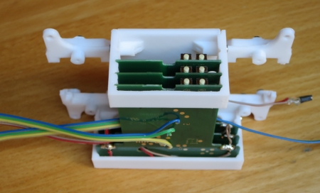

# WW-mySHP - HB-LC-Bl1-Velux

[Zurück zur Übersicht ...](../README.md)

#### Projekt-Beschreibung

Grundlage ist das 'Asksin++' Script 'HB-LC-Bl1-Velux' von papa. Darauf aufbauend wurde ein universiell konfigurierbares Script entwickelt, aus dem das Projekt 'HB-LC-Bl1-Velux - Velux KLI 310 Integration in HomeMatic zur Steuerung von Velux Rolladen' entstand.

[Original-Script papa ...](https://github.com/pa-pa/AskSinPP/tree/master/examples/custom/HB-LC-Bl1-Velux)

Folgende Änderungen und Erweiterungen wurden durchgeführt:
- für eine einfache Konfiguration wurde zusätzlich eine '<HB_LC_BL1_Velux_ext.h>' angelegt, in der alle wesentlichen Konfigurationsparameter zusammengefasst sind - es braucht nun nicht mehr das Original INO File geändert werden.
- es können sowohl batteriebetriebene als auch Geräte mit Festspannung konfiguriert werden.
- Unterstützung unterschiedlicher 'Asksin++' Platinen
- einheitliches Gehäuse für diese Platinen im 3D-Druck

#### Aufbau

Am besten kann der Aufbau der Schaltung über eine der vorhandenen 'Asksin++' Universal-Platinen erfolgen:

- 'einfache' Versionen (bastelaufwendig) - siehe Bilder unten
  - Platine 'HM-UNI-Mini' - Ronny Thomas - [Zeigen ...](https://github.com/ronnythomas/HB-Mini)
  
- 'erweiterte' Version
  - Platine 'HB-UNI-Mini-X' - [Zeigen ...](https://github.com/wolwin/WW-myPCB/tree/master/PCB_HB-UNI-Mini-X)
  - mit Platine 'HB-UNI-Mini-X AddOn' - [Zeigen ...](https://github.com/wolwin/WW-myPCB/tree/master/PCB_HB-UNI-Mini-X-AddOn)

#### INO-Script
INO-Script (2-Kanäle) papa: ['HB-LC-Bl1-Velux_2'](./bin/HB-LC-Bl1-Velux_2_20200722.zip)
 
Frei konfigurierbares INO-Script : ['HB-LC-Bl1-Velux_ext'](./bin/HB_LC_BL1_Velux_ext_20200722.zip)

#### Konfiguration und Inbetriebnahme

Wichtig in diesem Zusammenhang ist, wieviele Velux Fenster (wie) angesteuert werden sollen. Es ist nicht notwendig, für jedes Velux Fenster einen eigenen Schaltkanal vorzusehen. Sollen nämlich immer zwei Velux Rolladen (oder mehr) gleichzeitig zusammen angesteuert werden, kann man dies durch eine Koppelung über einen Velux KLI 310 Wandschalter erreichen:

[VELUX - Produkte löschen und Gruppen anlegen mit dem Funk-Wandschalter KLI](https://www.youtube.com/watch?v=4bwj79AXB-s)

- Zusammenfassung:
  
  - Löschen von Produkten auf einem KLI Wandschalter
    - je 1 Sekunde mit einer aufgebogenen Büroklammer nacheinander Zahnrad- und Kopplungssymbol-Symbol drücken
  
  - Gruppen auf einem KLI Wanschalter anlegen
    - 1 Sekunde Zahnrad-Symbol auf dem Quell KLI-Wandschalter drücken und anschließend 1 Sekunde das Kopplungssymbol auf dem Ziel KLI-Wandschalter drücken

Mit dem Einbau einer derart gekoppelten Velux KLI 310 Platine ist es dann mit nur einem Asksin++ Modul möglich, mehrere Velux Rolladen gleichzeitig zu bedienen.

Das erweiterte INO-Script hier herunterladen und in '<HB_LC_BL1_Velux_ext.h>' die Konfigurationsparameter anpassen. Dabei sollte man sich für eine der beiden Asksin++ Platinen entscheiden, mit denen man den Aufbau vornehmen möchte. Letzlich entscheidet die Konfiguration und der Umfang über die Auswahl: die Platine 'HM-UNI-Mini' eignet sich gleichermaßen, wie die  Platine 'HB-UNI-Mini-X'. Die Platine 'HB-UNI-Mini-X' bietet zusammen mit der Platine 'HB-UNI-Mini-X AddOn' eine integrative Gesamtlösung, während mit der 'HM-UNI-Mini' Platine evtl. für Spannungsregelung und/oder Spannungsmessung zusätzlich ein 'Lochraster AddOn' mit aufgebaut werden muß (siehe unten).

- Der wesentliche Unterschied wird über die Konfiguration des Defines USE_WOR vorgenommen - dabei wird zwischen nicht batteriebetriebenen und batteriebetriebenen Geräten unterschieden:

  | **#define USE_WOR** | **Device Modell** | 'JP-HB-Devices' AddOn |
  | --- | --- | --- |
  | nicht gesetzt | HM-LC-Bl1-FM | nein - nicht notwendig|
  | gesetzt | HB-LC-Bl1-Velux | ja - notwendig |

  - bei den batteriebetriebenen Geräten wird immer das ['JP-HB-Devices' AddOn](https://github.com/jp112sdl/JP-HB-Devices-addon) mit dem aktuellen [Release](https://github.com/jp112sdl/JP-HB-Devices-addon/releases) (ab Version 2.28) benötigt.
  
- Die zweite Auswahl betrifft die Anzahl der Kanäle pro Gerät (CHANNEL_COUNT): die Standardanzahl ist 1, es ist jedoch auch möglich zwei Kanäle (sprich: zwei KLI 310 Platinen) pro Asksin++ Modul zu steuern (Achtung: FHEM kann standardmäßig nur einen Kanal bedienen).
- Es finden sich noch weitere wichtige Einstellungen für einen stromsparenenden Batteriebetrieb, die konfiguriert werden können.
  - Im ZIP-Archiv sind zwei TXT-Dateien als Vorlage enthalten, die m.E. die besten Einstellungen für einen 1- bzw. 2-kanaligen Batteriebetrieb (incl. Batteriespannungsmessung über Spannungsteiler) zeigen:
      - 'HB_LC_BL1_Velux_ext.h.WOR-1-channel.txt'
      - 'HB_LC_BL1_Velux_ext.h.WOR-2-channel.txt'
  

- Soll der Arduino Pro Mini mit Batterie betrieben werden, sollte der Ruhestrom gesenkt werden - [siehe Tom Major - 'Ruhestrom Arduino Pro Mini'](https://github.com/TomMajor/SmartHome/tree/master/Info/Ruhestrom/).

- Nach der Konfiguration wie gewohnt das INO Script kompilieren und über den 6-poligen ISP Anschluß auf der Platine hochladen - [siehe AskSin++ - 'Software flashen' - 'FTDI Adapter'](https://asksinpp.de/Grundlagen/02_software.html#anschluss-des-ftdi-adapters).

  - _Nur für Experten_: Wichtig in diesem Zusammenhang ist natürlich, dass auch die 'Fuse Bits'
des AVRs richtig gesetzt sind: z.B. für das Abspeichern der Frequenzeinstellung des CC1101 Sendemodul ein EEPROM Speicherbereich zur Verfügung gestellt wird ([siehe CC1101 Frequent Test](https://asksinpp.de/Grundlagen/FAQ/Fehlerhafte_CC1101.html)) oder im Batteriebetrieb die Abschaltung des Sendemoduls bei zu niedriger Versorgungsspannung gewährleistet ist ([siehe Abschaltung oder Dauersender/-störer trotz fast voller Batterien](https://asksinpp.de/Grundlagen/FAQ/babbling_idiot.html#dauersender-babbling-idiot)).   
    Asksin++ Fuses:
    | **Fuse** | **Wert** | **Bemerkung** |
    | --- | --- | --- |
    | Low Fuse | 0xFF | AVR ext. osc, 8.0 MHz (CKSEL=1111 SUT=11) |
    | High Fuse | 0xD2 | für CC1101 Frequenz im EEPROM Speicherbereich |
    | Extended Fuse | 0xFF |  Brown-out detection disabled (BODLEVEL=111) |

    Hier ein sehr guter Erklärungs-Link dazu:
  [Engbedded Atmel AVR Fuse Calculator](http://www.engbedded.com/fusecalc?P=ATmega328P&V_LOW=0xE2&V_HIGH=0xD2&V_EXTENDED=0xFF&O_HEX=Apply+values)

- Zusammenbau und mit Anlernen an der Zentrale die Platine(n) in Betrieb nehmen - zu den Details ... siehe Bilder unten.

#### 3D-Print
- 3D-Druck Projekt für 'HB-LC-Bl1-Velux' - [Zeigen ...](https://github.com/wolwin/WW-my3DP/blob/master/3DP_HB-LC-BL1-Velux-KLI310/README.md)

#### Bilder
- Velux KLI 310 Wandtaster
  

  
- Öffnen des Velux KLI 310 Wandtaster durch Zurückbiegen der Clipse und Trennen der Gehäusehälften.
  

  
- Entfernen der Platine durch Zurückbiegen der Clipse und vorsichtiges Heraushebeln an den Batterielaschen.
  

  
- Übersicht der Velux KLI 310 Platine mit den relevanten Lötpunkten - die Batterielaschen müssen entfernt (abgelötet) werden (rote Pfeile).
  

  
- Velux KLI 310 Platine mit den angelöteten Verbindungskabeln.
  

  
- Fertig aufgebautes Asksin++ Modul mit Platine 'HM-UNI-Mini' (Draufsicht) und optionales 'Lochraster AddOn' für Spannungsregulierung und Asksin Spannungsmessung über Spannungsteiler
  

  
- Fertig aufgebautes Asksin++ Modul mit Platine 'HM-UNI-Mini' mit zwei 3-fach Anschlußpins für die Velux KLI 310 Verbindungen
  

  
  - Schaltung des optionalen 'Lochraster AddOn' für Spannungsregulierung und Asksin Spannungsmessung über Spannungsteiler.
  - Diese Schaltung ist nicht notwendig, wenn man die Platinen 'HB-UNI-Mini-X' und 'HB-UNI-Mini-X AddOn' einsetzt - dort ist die Schaltung integriert.
  

  
  - Ansichten des optionalen 'Lochraster AddOn'.
  

  
- Trägerplatte mit zwei Asksin++ Modulen und Velux KLI 310 Platine vor dem Zusammenbau.
  

  
- Trägerplatte mit drei Velux KLI 310 Platinen (Ansicht von oben).
  

  
- Trägerplatte mit drei Velux KLI 310 Platinen (Ansicht von unten).
  

  
- Trägerplatte mit zwei Asksin++ Modulen (incl. 'Lochraster AddOn') und drei Velux KLI 310 Platinen (Ansicht von oben).
  

  
- Verdarhtung Trägerplatte mit zwei Asksin++ Modulen (incl. 'Lochraster AddOn') und drei Velux KLI 310 Platinen (Ansicht von unten).
  

  
- Ansicht Verdarhtung eines Asksin++ Moduls (incl. 'Lochraster AddOn') und drei Velux KLI 310 Platinen (Ansicht seitlich von unten).
  

  
- In das Gehäuse eingesezte Trägerplatte mit zwei Asksin++ Modulen (incl. 'Lochraster AddOn'), 3-fach AA-Batteriehalter und drei Velux KLI 310 Platinen (Ansicht von oben).
  

  
- Gehäuseansicht von oben auf Trägerplatte mit zwei Asksin++ Modulen, 3-fach AA-Batteriehalter und drei Velux KLI 310 Platinen.
  

  
- Mit Anlernen an der Zentrale die Platine(n) in Betrieb nehmen.
  

  

  
  - <u>!!! WICHTIG !!!</u>  
    - Es kann sein, dass die sogenannten 'Peerings' beim ersten Koppeln mit der CCU nicht, oder nicht vollständig angelegt werden - d.h. man kann keine Einstellungen für das Gerät vornehmen. Dies sollte also immer nach dem Anlernvorgang überprüft werden (siehe Bild).
    - Sollten die Einstellungen nicht richtig vorhanden sein oder eine Fehlermeldung auftauchen, dann muß man am Asksinn-Modul einen RESET ausführen (Reset-Taster lange gedrückt halten). Manchmal kann es sein, dass das Modul erst nach dem zweiten / dritten Reset sich korrekt mit der CCU verbindet.
    
  
    
- Geschlossenes Gehäuse (groß) mit gekoppelter Homematic Fernbedienung HM-RC-8.
  

  

#### Historie
- 2020-07-24 - Erstveröffentlichung
