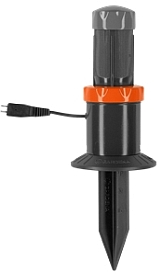
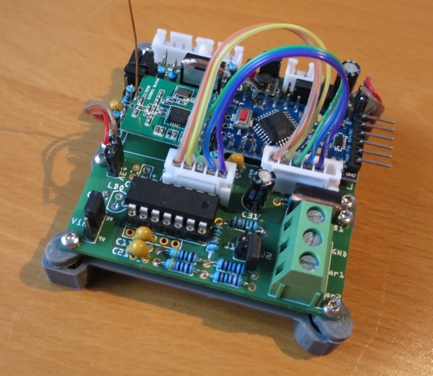

# WW-mySHP - SHP_HB-SCI-4-O-Gar118x

[Zurück zur Übersicht ...](../README.md)

#### Projekt-Beschreibung

Anschluß von GARDENA Bodenfeuchte- und Regensensor 118x an eine Homematic Zentrale mit 'AskSin++' Modul 'HB-UNI-Mini-X' (oder 'HB-UNI-Sens-X') und der Sensorplatine 'Sens-Gar-118x'. Es können auch statt der GARDENA Geräte potentialfreie Schalter angeschlossen werden.

  - GARDENA - Bodenfeuchtesensor 1188-20 [(Bedienungsanleitung)](./bin/GARDENA_Anleitung_1188-20_Feuchtesensor.pdf)
  

  
  - GARDENA - Regensensor electronic 1189-20 [(Bedienungsanleitung)](./bin/GARDENA_Anleitung_1189-20_Regensensor.pdf)
  

Alle 5 Minuten wird der Status der angeschlossenen GARDENA 118x Sensoren (bzw. potential freien Schaltern) überprüft (feucht / trocken und Leitungsstatus) und bei Änderung an die Homematic Zentrale geschickt. Eine Ruhestromaufnahme von nur 11 uA mit 3 AA Batterien soll eine langfristige Laufzeit garantieren.

#### Aufbau
Das Gerät besteht aus zwei Teilen: der Sensor-Platine 'Sens-Gar-118x' (Platinenbestückung incl. Spannungsversorgung 4 - 9 V) und dem 'AskSin++' Modul (minimale Platinenbestückung):
  - SHP-Projekt 'Sens-Gar-118x' - [Zeigen ...](https://github.com/wolwin/WW-mySHP/blob/master/SHP_Sens-Gar-118x/README.md "Zeigen ...")
  - SHP-Projekt 'HB-UNI-Mini-X' - [Zeigen ...](https://github.com/wolwin/WW-mySHP/blob/master/SHP_HB-UNI-Mini-X/README.md "Zeigen ...")

#### Konfiguration

Die Anschlußkonfiguration und das Erscheinungsbild in der Homematic Zentrale (Anzahl / Bedeutung der Schalter) wird mit Hilfe der Jumper J1 und J2 auf der Sensor-Platine 'Sens-Gar-118x' und in der Datei 'HB-SCI-4-O-Gar118x.h' über die Defines 'CHANNEL_COUNT', 'CHANNEL_PINS' und 'CHANNEL_DEBUG' festgelegt.

  - Als Default-Einstellung ist der Anschluß von zwei GARDENA Geräten voreingestellt:

        Variante 2 - mit Fehler-Kanal (default)
        Platine
        Jumper  : J1 = OFF  J2 = OFF
        Inp-Gar1: Gardena 1188-20 (Feuchte)
        Inp-Gar2: Gardena 1189-20 (Regen)

- Übersicht Anschluß-Varianten 'Sens-Gar-118x' - [Zeigen ...](./bin/HB-SCI-4-O-Gar118x_Varianten.pdf "Zeigen ...")
- Detail Anschluß-Varianten 'Sens-Gar-118x' - [Zeigen ...](./bin/HB-SCI-4-O-Gar118x_Varianten.txt "Zeigen ...")

#### INO-Script
[Download ...](./bin/HB-SCI-4-O-Gar118x_20191228.zip)

#### Inbetriebnahme
Zwischen den Platinen müssen zur Inbetriebnahme noch folgende Kabelverbindungen hergestellt werden:

| **Sens-Gar-118x** | **HB-UNI-Mini-X** |
| --- | --- |
| GND | GND |
| PA0 | A1 |
| PA1 | A2 |
| PA2 | A3 |
| PA3 | PD5 |
| PA4 | PD6 |
| VCC | VCC |

#### 3D-Print
- 3D-Druck Projekte für 'HB-SCI-4-O-Gar118x' - [Zeigen ...](https://github.com/wolwin/WW-my3DP/blob/master/README.md)

#### Bilder
- 'HB-UNI-Sens-X' mit 'Sens-Gar-118x'
  

  

#### Historie
- 2020-01-10 - Erstveröffentlichung
