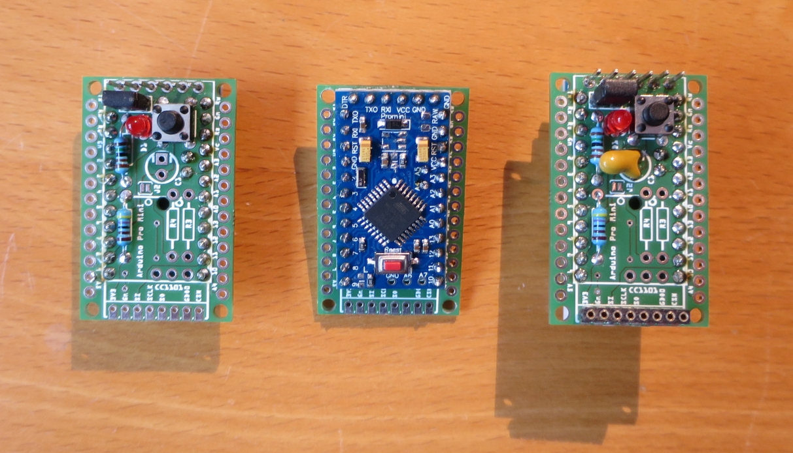
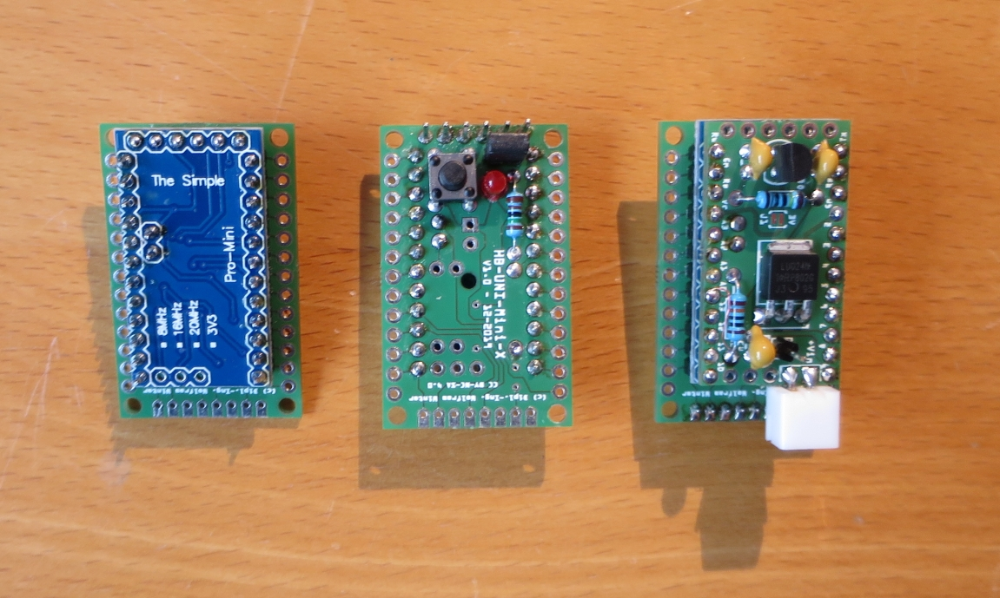
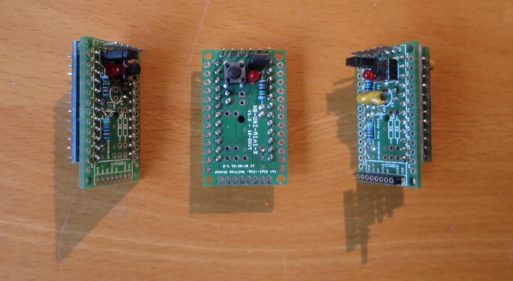
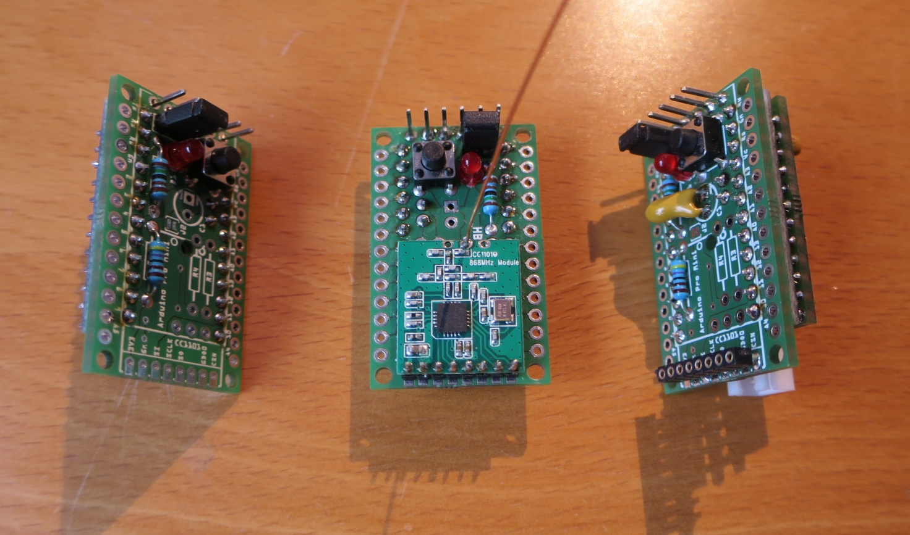
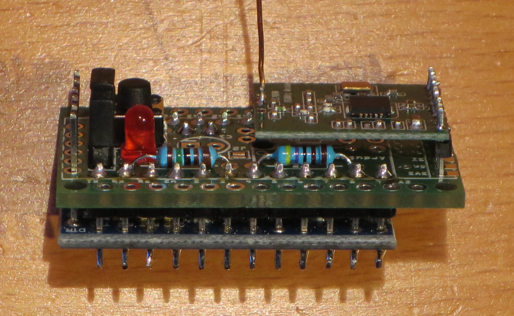
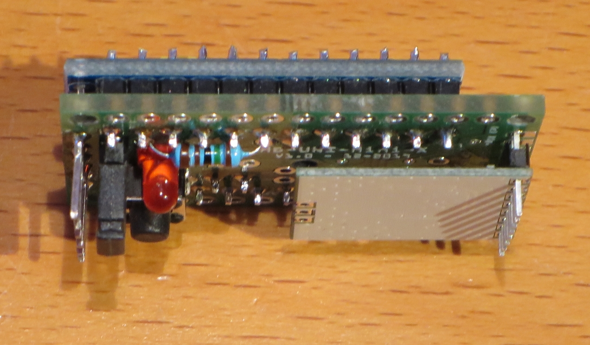
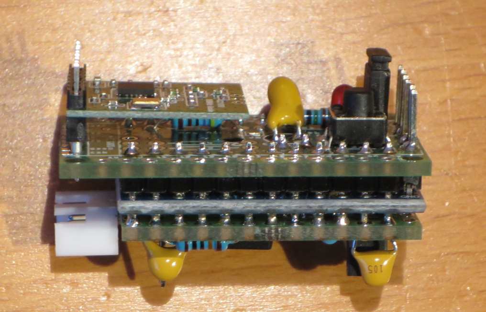

# WW-mySHP - HB-UNI-Mini-X

[Zurück zur Übersicht ...](../README.md)

### Projekt-Beschreibung
Universelle 'AskSin++' Mini-Platine im THT-Format. Es sind alle Ports des 'Arduino Pro Mini' über zwei beschriftete Port Reihen (bestückbar mit Pin-Header oder JST-XH) zugänglich. Optionale Pullup Widerstände für I2C und 1-Wire Anschluß können verbaut werden. Eine Einbau- bzw. Montagemöglichkeit kann über vier 2 mm Platinen-Löcher realisiert werden.

AddOn Platine für 'HB-UNI-Mini-X' im THT-Format. Mit 'HB-UNI-Mini-X' und dem 'HB-UNI-Mini-X-AddOn' kann die Kern-Funktionalität der 'HB-UNI-Sens-X' Platine erreicht werden.

### Platine
- Platine 'HB-UNI-Mini-X' - [Zeigen ...](https://github.com/wolwin/WW-myPCB/blob/master/PCB_HB-UNI-Mini-X/README.md)
- Platine 'HB-UNI-Mini-X-AddOn' - [Zeigen ...](https://github.com/wolwin/WW-myPCB/blob/master/PCB_HB-UNI-Mini-X-AddOn/README.md)

### 3D-Print
- 3D-Druck Projekte für 'HB-UNI-Mini-X' - [Zeigen ...](https://github.com/wolwin/WW-my3DP/blob/master/3DP_OBO_T40_HB/README.md)

### Bilder
- Übersicht - 'HB-UNI-Mini-X'
  - Links: Variante 1 (default) - Bestückung oben, 'Arduino Pro Mini' unten
  - Mitte: Variante 2 - 'Arduino Pro Mini' oben, (Teil-) Bestückung unten
  - Rechts: Variante 1 - zusätzlich mit 'HB-UNI-Mini-X-AddOn'
  
- Vorderseite (ohne Sendemodul)
  

  
- Rückseite (ohne Sendemodul)
  

  
- Seitenansicht (ohne Sendemodul)
  

  
- Ansicht mit Sendemodul
  

  
- Detailansicht Variante 1 mit Sendemodul
  

  
- Detailansicht Variante 2 mit Sendemodul
  

  
- Detailansicht Variante 1 mit 'HB-UNI-Mini-X-AddOn' und Sendemodul
  

### Historie
- 2020-01-10 - Erstveröffentlichung
