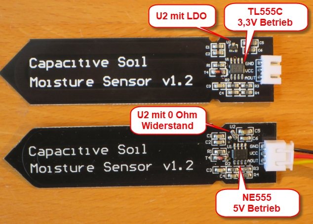
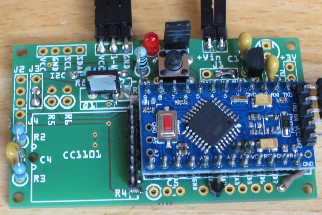
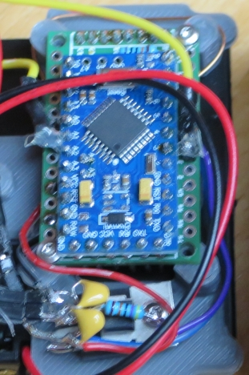
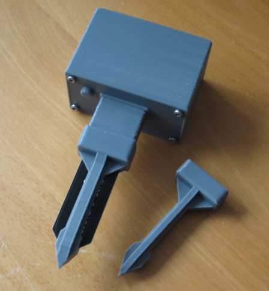
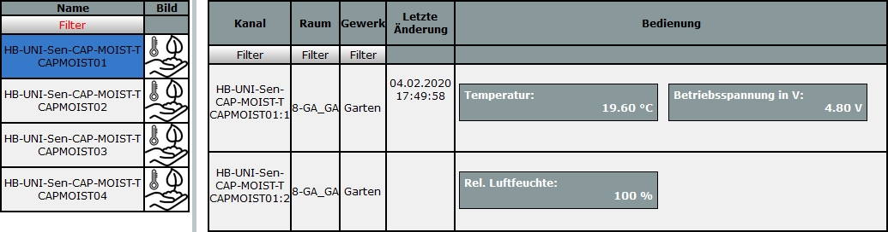

# WW-mySHP - HB-UNI-Sen-CAP-MOIST

[Zurück zur Übersicht ...](../README.md)

#### Projekt-Beschreibung

Grundlage ist das 'Asksin++' Projekt 'HB-UNI-Sen-CAP-MOIST - Kapazitiver Bodenfeuchtesensor mit optionalem Temperatursensor DS18B20 für die Integration in HomeMatic' von Jérôme Pech:

[Original-Projekt zeigen ...](https://github.com/jp112sdl/HB-UNI-Sen-CAP-MOIST)

Beim Aufbau und dem Testen sind folgende Dinge aufgefallen:
- es gibt unter gleicher Produktbezeichnung unterschiedlich bestückte Feuchtesensoren, die entweder nur mit 5V Versorgungsspannung funktionieren (hier nicht geeignet), oder schon ab 3V funktionieren, dann aber dauerhaft 2-3 mA Strom verbrauchen
- die Kalibrierung der Feuchtesensoren und die anschließenden fortlaufenden Messungen stehen in Abhängigkeit von der Versorgungsspannung - d.h.: ändert sich die Versorgungsspannung (Batteriekapazität nimmt ab), dann ändert sich auch der Kailibrierungs(null)punkt - man erhält nur dann korrekte Meßergebnisse, wenn Kalibrierung und Messungen mit einer gleichbleibenden (=geregelten) Versorgungsspannung durchgeführt werden
- für den Temperatursensor DS18B20 ist eigentlich ein Ruhestromverhalten von 2uA angegeben - jedoch gibt es auf dem Markt auch Fake-Exemplare, die durchgehend 40uA verbrauchen - zuviel in einer stromsparenden Batterieumgebung

Folgende Änderungen und Erweiterungen wurden durchgeführt (das führt dann im Betrieb zu einem Ruhestrom von <7uA):
- der Originalaufbau auf der Hardwareseite wurde um eine stromsparende 3,3V LDO-Spannungsregelung und einen N-MOSFET Schalter für die Sensoren erweitert
- das INO-Skript wurde für die MOSFET-Schaltung entsprechend angepaßt
- für eine einfache Konfiguration wurde zusätzlich noch eine '<HB-UNI-Sen-CAP-MOIST_ext.h>' angelegt, in der alle wesentlichen Konfigurationsparameter zusammengefasst sind - es braucht nun nicht mehr das Original INO File geändert werden

Weiter wurde zusätzlich entwickelt:
- Unterstützung unterschiedlicher 'Asksin++' Platinen
- einheitliches Gehäuse für diese Platinen im 3D-Druck

#### Aufbau

Am besten kann der Aufbau der erweiterten Schaltung über eine der vorhandenen 'Asksin++' Universal-Platinen erfolgen:

- 'normale' Version
  - Platine 'HB-UNI-Sens-X' - [Zeigen ...](https://github.com/wolwin/WW-myPCB/tree/master/PCB_HB-UNI-Sens-X)
  - [Übersicht Platinenverdrahtung ...](./bin/HB-UNI-Sen-CAP-MOIST_ext_Verdrahtung_HB-UNI-Sens-X.pdf)
  - [Teile- und Bestückungsliste ...](./bin/HB-UNI-Sen-CAP-MOIST_HB-UNI-Sens-X_Teileliste.txt)
  
- 'einfache' Versionen (bastelaufwendig)
  - Platine 'HB-UNI-Mini-X' - [Zeigen ...](https://github.com/wolwin/WW-myPCB/tree/master/PCB_HB-UNI-Mini-X)
  - Platine 'HM-UNI-Mini' - Ronny Thomas - [Zeigen ...](https://github.com/ronnythomas/HB-Mini)
  - [Übersicht Platinenverdrahtung ...](./bin/HB-UNI-Sen-CAP-MOIST_ext_Verdrahtung_HB-UNI-Mini-X.pdf)

#### INO-Script
[Download ...](./bin/HB_UNI_Sen_CAP_MOIST_ext_20200530.zip)

#### Konfiguration

Das erweiterte INO-Script hier herunterladen und in '<HB-UNI-Sen-CAP-MOIST_ext.h>' die Konfigurationsparameter anpassen - dann weiter, wie im Original-Projekt ...

[Siehe Original-Projekt ...](https://github.com/jp112sdl/HB-UNI-Sen-CAP-MOIST#code-flashen)

#### Inbetriebnahme

[Siehe Original-Projekt ...](https://github.com/jp112sdl/HB-UNI-Sen-CAP-MOIST#gerät-anlernen)

#### 3D-Print
- 3D-Druck Projekt für 'HB-UNI-Sen-CAP-MOIST' - [Zeigen ...](https://github.com/wolwin/WW-my3DP/blob/master/3DP_HB-UNI-Sen-CAP-MOIST/README.md)

#### Bilder
- Unterschiedliche 'Capacitive Soil' Sensoren
  
  
- Bestückte Platine 'HB-UNI-Sens-X'
  
  
- Bestückte Platine 'HB-UNI-Mini-X' mit seitlich angeordnetem LDO-Spannungsregler und N-MOSFET Schalter
  
  
- 3D-Druck Gehäuse 'HB-UNI-Sen-CAP-MOIST' mit Feuchte- und Temperatursensor
  
  
- Vier Feuchtesensoren in der CCU Zentrale
  
  

#### Historie
- 2020-07-20 - Fehler in der PDF-Übersicht Platinenverdrahtung HB-UNI-Mini-X korrigiert
- 2020-05-30 - INO-Script - Fixing compiler warnings
- 2020-02-04 - Erstveröffentlichung
