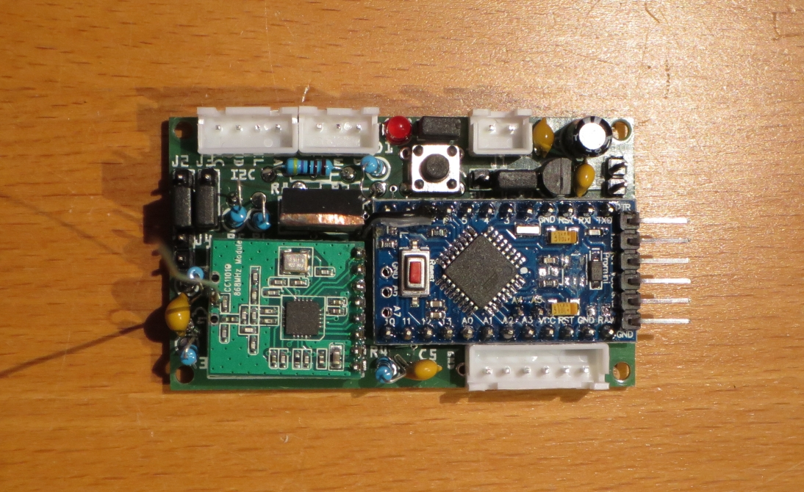
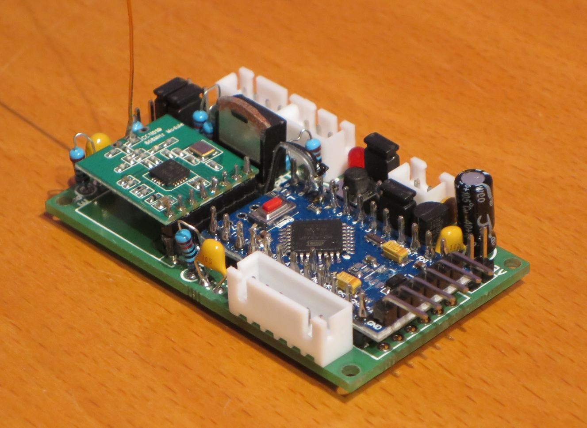

# WW-mySHP - HB-UNI-Sens-X

[Zurück zur Übersicht ...](../README.md)

### Projekt-Beschreibung
Universelle 'AskSin++' Platine mit verschiedenen Sensor Anschluß- und Konfigurationsmöglichkeiten im THT-Format. Eine Einbau- bzw. Montagemöglichkeit kann über vier 2 mm Platinen-Löcher realisiert werden.

- Ziel des Projektes war, eine universelle Platine im THT-Format ('Through Hole Technology') zu erstellen, an die unterschiedliche Sensoren für unterschiedliche 'AskSin++' Projekte angeschlossen werden können. Gleichzeitig sollte hardwareseitig ein Batterie-Betrieb mit möglichst geringer Stromaufnahme sichergestellt werden - alternativ sollte auch der Betrieb an einer externen Festspannung (4 - 9 V) möglich sein.
Dabei fiel die Wahl auf einen 'Step-Down' LDO (Low Drop-Out) Spannungsregler, da dieser sowohl einen Batterie- als auch Festspannungsbetrieb möglich macht - ein evtl. größerer Raumbedarf für die Batterien / Akkus wurde dabei bewußt in Kauf genommen.

  - Ein interessanter Artikel über batteriebetriebene Anwendungen ist auf der 'Mikrokontroller.net'-Side veröffentlicht worden - [Zeigen ...](https://www.mikrocontroller.net/articles/Versorgung_aus_einer_Zelle)

- Die Möglichkeit einer Software gesteuerten GND-Schaltung (An/Aus) stellt mit einem optionalen N-MOSFET für I2C und / oder 1-Wire Komponneten sicher, dass die Sensoren während der 'Schlafphase' des Moduls zur Minimierung des Stromverbrauchs abgeschaltet werden können.

- Optionale Batteriespannungsmessung über Spannungsteiler zur Vermeidung des "Babbling Idiot" (Dauersender) im Homematic Netzwerk bei Selbstbaugeräten.
  - Artikel auf der 'AskSin++'-Side - [Zeigen ...](https://asksinpp.de/Grundlagen/FAQ/babbling_idiot.html=)
  - Artikel auf Github 'Tom Major'-Side - [Zeigen ...](https://github.com/TomMajor/SmartHome/tree/master/Info/Babbling%20Idiot%20Protection)

- Alle wichtigen Informationen zu 'AskSin++' findet man auf der 'AskSin++'-Side - [Zeigen ...](https://asksinpp.de/)

### Platine
- Platine 'HB-UNI-Sens-X' - [Zeigen ...](https://github.com/wolwin/WW-myPCB/blob/master/PCB_HB-UNI-Sens-X/README.md)

### INO-Skripte
- Grundsätzlich sind (fast alle) 'AskSin++' INO-Skripte (evtl. nach entsprechender Anpassung) auf der Platine lauffähig - dabei ist natürlich auf die hardwareseitige Port-Zuordnung zu achten.
- Besonders ist hier die Entwicklung 'Universalsensor HB-UNI-Sensor1' von Tom Major zu nennen - sein zugehöriges INO-Skript ist direkt auch auf der 'HB-UNI-Sens-X' Platine lauffähig:
  - Github 'Tom Major' - HB-UNI-Sensor1 - [Zeigen ...](https://github.com/TomMajor/SmartHome/tree/master/HB-UNI-Sensor1)
- Eine angepaßte Version des 'HB-UNI-Sensor1' Skripts, das auch die Option der MOSFET-Schaltung für I2C und 1-Wire Komponenten bietet, findet sich hier - [Download ...](./bin/HB-UNI-Sensor1_V1.17_MOSFET.zip)

### 3D-Print
- 3D-Druck Projekte für 'HB-UNI-Sens-X' - [Zeigen ...](https://github.com/wolwin/WW-my3DP/blob/master/3DP_OBO_T40_HB/README.md)

### Bilder
- Übersicht - 'HB-UNI-Sens-X'
  - Vollausstattung mit allen Optionen
  - I2C-Bus, 1-Wire und die freien Ports des 'Arduino Mini Pro' sind über JST-XH Buchsen herausgeführt (oben links und unten rechts)
  - Anschluß der Spannungsversorgung erfolgt ebenfalls über eine JST-XH Buchse (oben rechts - die Eingangsspannung ist hier für 4-9 V konfiguriert)
  
- 'HB-UNI-Sens-X' Draufsicht
  

  
- 'HB-UNI-Sens-X' mit gesockeltem Sendemodul
  

  

### Historie
- 2020-01-10 - Erstveröffentlichung
