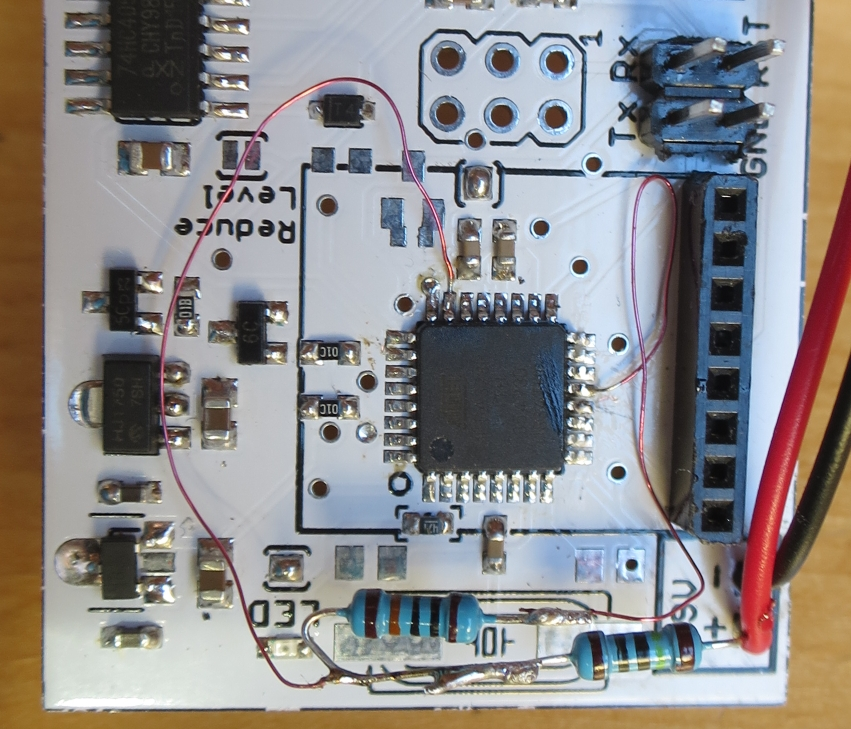
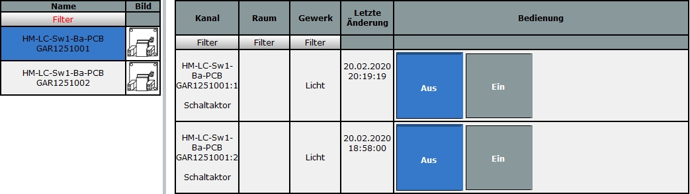

# WW-mySHP - HM-LC-SW1-BA-PCB-GAR1251

[Zurück zur Übersicht ...](../README.md)

#### Projekt-Beschreibung

 Grundlage ist das 'Asksin++' Projekt 'Umbau GARDENA Bewässerungsventil (1251-20) 9V auf HomeMatic' von Gelegenheitsbastler:

[Original-Projekt zeigen ...](https://homematic-forum.de/forum/viewtopic.php?f=76&t=49719&p=498577&hilit=HomeMatic+Gardena+Ventil)

Bei der Inbetriebnahme der fertig aufgebauten Platine und dem Testen sind folgende Dinge aufgefallen:
- es findet keine durchgreifende Überprüfung der Batteriespannung statt ([siehe 'Dauersender / Babbling Idiot'](https://asksinpp.de/Grundlagen/FAQ/babbling_idiot.html))
- Einstellparameter aus der CCU werden nicht alle vom Modul übernommen

#### Änderungen
Für das Platinen-Design V2.1 wurde ein Spannungsteiler aufgelötet, der zusammen mit einer erweiterten Firmware dafür sorgt, dass bei Unterschreitung der Batteriespannung das Modul mit CCU Meldung sich selbst deaktiviert. Im nächsten Platinen-Layout ist die Spannungsüberwachung direkt integriert.

#### Beschreibung
Die bisherige Firmware 'Gardena_Ventil' wurde komplett überarbeitet. Die softwareseitige Änderung bzw. Erweiterung besteht aus drei Dateien:

- HM-LC-SW1-BA-PCB-GAR1251.ino - geänderte Firmware
- HM-LC-SW1-BA-PCB-GAR1251.h - Zusammenfassung aller möglichen Konfigurationsparameter
- tmBattery.h - [siehe Tom Major - 'Dauersender / Babbling Idiot'](https://github.com/TomMajor/SmartHome/tree/master/Info/Babbling Idiot Protection/")

Von der Struktur her ist die Firmware an das eigentliche Ursprungsscript 'HM-LC-SW1-BA-PCB' angelehnt worden und wurde daher auch entsprechend umbenannt: 'HM-LC-SW1-BA-PCB-GAR1251'. Alle Konfigurationsmöglichkeiten sind jetzt in eine Konfigurationsdatei ausgelagert - d.h.: möchte man die Konfiguration ändern, kann man dies in der Konfigurationsdatei machen, ohne das eigentlich INO Script anfassen zu müssen. Welche Einstellungen man ändern kann, ist dort ausführlich in den Kommentaren dokumentiert.

 Folgende CCU-Einstellungen funktionieren jetzt: minimaler Batterie-Schwellwert (man kann sich jetzt bei Falscheingabe der minimalen Batteriespannung nicht mehr selbst aussperren, da die Falscheingabe nicht vom Modul übernommen wird) und Geräte-LED. Weiter kann bei der 'AskSin++' Konfiguration die Art des Batterieüberprüfung, die CC1101 Frequenz und der Modus des Anlernbuttons festgelegt werden. 'Alle' Funktionen wurden ausprobiert und auf Funktion geprüft - vom Aufspielen bis zum Schalttest am Gardena-Ventil ...

 - _Nur für Experten_: Wichtig in diesem Zusammenhang ist natürlich, dass auch die 'Fuse Bits'
 des AVRs richtig gesetzt sind: das 'High Fuse' Bit muss für 'AskSin++' unbedingt auf '0xD2' gesetzt werden, damit z.B. für das Abspeichern der Frequenzeinstellung des CC1101 Sendemodul ein EEPROM Speicherbereich zur Verfügung gestellt wird ([siehe CC1101 Frequent Test](https://asksinpp.de/Grundlagen/FAQ/Fehlerhafte_CC1101.html)).  
 'HM-LC-SW1-BA-PCB-GAR1251' Fuses: 
   | **Fuse** | **Wert** | **Bemerkung** |
   | --- | --- | --- |
   | Low Fuse | 0xE2 | !! _Nicht_ auf 'AskSin++'-Wert '0xFF' ändern !! |
   | High Fuse | 0xD2 | für CC1101 Frequenz im EEPROM Speicherbereich |
   | Extended Fuse | 0xFF |  Brown-out detection disabled (BODLEVEL=111) |

   Hier ein sehr guter Erklärungs-Link dazu:
   [Engbedded Atmel AVR Fuse Calculator](http://www.engbedded.com/fusecalc?P=ATmega328P&V_LOW=0xE2&V_HIGH=0xD2&V_EXTENDED=0xFF&O_HEX=Apply+values)

#### INO-Script
  [Download ...](./bin/HM-LC-SW1-BA-PCB-GAR1251_20200221.zip)

#### 3D-Print
  - 3D-Druck Projekt für 'GARDENA EasyControl' mit 'HM-LC-SW1-BA-PCB-GAR1251' - [Zeigen ...](https://github.com/wolwin/WW-my3DP/blob/master/3DP_GARDENA_EasyControl/README.md)

#### Hardware
Falls eine Batteriespannungsmessung über Spannungsteiler durchgeführt werden soll, kann für das Platinen-Layout V 2.1 eine Hardware-Modifikation vorgenommen werden (entfällt für das nächste Platinen-Layout).
- Schaltung Spannungsteiler
  

  
- Beispiel - fliegender Aufbau:
  

#### Konfiguration und Inbetriebnahme
Das INO-Script hier herunterladen und in 'HM-LC-SW1-BA-PCB-GAR1251.h' die Konfigurationsparameter anpassen - z.B. den voreingestellten Wert '#define BAT_SENSOR_MODE 1' = 'keine Batteriespannungsmessung' auf '#define BAT_SENSOR_MODE 2' für 'Batteriespannungsmessung über Spannungsteiler' umstellen. Dann weiter, wie gewohnt das INO Script kompilieren und über den 6-poligen ISP Anschluß auf der Platine hochladen. Mit Anlernen an der Zentrale in Betrieb nehmen.
  

#### Historie
- 2020-02-23 - Veröffentlichung an dieser Stelle
