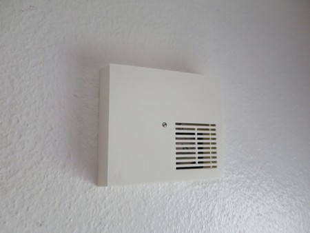

# WW-mySHP - Klingel Integration mit Homematic Klingel-Sensor

[Zurück zur Übersicht ...](../README.md)

### Projekt-Beschreibung
Es sollte eine vorhandene Türklingel aus den 1980er Jahren ohne weitere Umbauten in das 'Homematic'-System integriert werden. Auf Grund der baulichen Gegebenheiten fiel die Entscheidung auf den 'Homematic Klingel-Sensor HM-Sen-DB-PCB'. Da dieser jedoch nicht mehr von der Herstellerfirma EQ3 angeboten wird, wurde das Modul gebraucht gekauft.

### Allgemeiner Aufbau
Die Klingel besteht aus einem einfachen Klingeltrafo mit 220 Volt Anschluß - sekundärseitig ist mit 8 Volt Wechselspannung die eigentliche Klingel und ein zweiadriges Kabel zum Außen-Klingeltaster angeschlossen. 

Der Einbauzustand der Klingel ließ eine Demontage ohne evtl. Beschädigungen nicht ratsam erscheinen. Somit wurde ein umgebender Rahmen mit Abdeckung für den 3D-Drucker konstruiert, der auf der Wand aufliegt und an dem zentralen Befestigungspunkt der Klingel befestigt wird. Gleichzeitig trägt dieser Rahmen den 'Homematic' Klingel-Sensor, ein Vorschaltmodul und eine 3,3 Volt Spannungsversorgung. 

### Technische Besonderheiten
Bei einfachen Klingel-Typen kann es sekundärseitig zu erheblichen Spannungsspitzen kommen, wenn die Klingel betätigt wird. Dies führt dann dazu, dass nachgeschaltete Elektronikelemente zerstört werden. So ist auch der 'Homematic Klingel-Sensor' nicht gegen diese Spannungsspitzen geschützt. 
Im FHZ-Forum wurde dies in mehrern Threads / Beiträgen diskutiert. Der hier vorgestellte Schaltungsentwurf basiert auf diesen Beiträgen:

[FHZ-Forum - Klingelsignalsensor womöglich defekt ...](https://homematic-forum.de/forum/viewtopic.php?f=27&t=30175#p274719)

[FHZ-Forum - Klingelsensor (HM-Sen-DB-PCB) ...](https://homematic-forum.de/forum/viewtopic.php?f=27&t=30188&hilit=jens+klingel&start=10#p275332)

### Technische Lösung
Auf einer Lochrasterplatine wurde die Klingel-Filterschaltung zur Spannungsbegrenzung aufgebaut. Außerdem wurde ein vergossener Spannungswandler von 220V Wechselstrom zu 3,3V Gleichstrom mit integriert, der die Batterie Spannungsversorgung des 'Homematic Klingel-Sensor' ersetzt.  
<i>Anmerkung:</i> der Widerstand R2 (33K/1W) muss je nach Klingeltrafo dimensioniert werden - er bestimmt die Entladungszeit des Kondensators C1 und damit, wie schnell die Klingel hintereinander betätigt werden kann (kurze Klingel-Tastendrücke).  
 
- Vorhandene Klingel mit Originalabdeckung:
  

  
- Filter-Schaltung:
  

  
- Filter-Schaltung mit Spannungsversorgung auf Lochrasterplatine:
  

  
- 'HM-Sen-DB-PCB' - mit 3D-Drucker erstellte AAA-Batterie-Dummy Anschlüsse
  

  
- 'HM-Sen-DB-PCB' - externe Stromversorgung 3,3 Volt 
  

  
- Grundrahmen mit Befestigungslöchern
  

  
- Grundrahmen mit 'HM-Sen-DB-PCB'
  

  
- Grundrahmen mit 'HM-Sen-DB-PCB' und Lochrastermodul
  

  
- montierter Grundrahmen mit verdrahtetem 'HM-Sen-DB-PCB' und Lochrastermodul
  

  
- Klingelabdeckung
  

### 3D-Print
- 3D-Druck für Klingel mit 'HM-Sen-DB-PCB' - [Zeigen ...](./bin/DIY_Klingel_20240227.zip)

### Historie
- 2024-02-27 - Erstveröffentlichung
