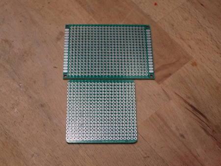

# WW-mySHP - HM-WM55_HM-MOD-Re-8

[Zurück zur Übersicht ... ](../README.md)

#### Projekt-Beschreibung

Realisierung der Hardware für eine 'Ampelanzeige', die offene Verschlüsse mit dem Homematic 8-Kanal-Empfangsmodul 'HM-MOD-Re-8' in einem WM55-Gehäuse anzeigt.

_Anmerkung:_ 
Es ist zu beachten, dass das batteriebetriebene Homematic Modul 'HM-MOD-Re-8' wegen seines Burst-Verhaltens (= Anstieg des DutyCycle) 'sparsam verwendet' werden sollte. Ein nach oben schnellender DutyCycle wird besonders bei der Darstellung von _sehr vielen Kanal-Ansteuerungen (LEDs)_ auftreten. Daher ist der Einsatzzweck des Moduls eher für eine niederfrequente Nutzung gedacht - dieser Ansatz sollte auch bei der Skript-Erstellung berücksichtigt werden.

#### Platine
- WM55-Platinen für das Projekt 'HM-WM55_HM-MOD-Re-8' - [Zeigen ...](https://github.com/wolwin/WW-myPCB/blob/master/PCB_WM55_HM-MOD-Re-8/README.md)

#### 3D-Print
- 3D-Druck für das Projekt 'HM-WM55_HM-MOD-Re-8' - [Zeigen ...](https://github.com/wolwin/WW-my3DP/blob/master/3DP_HM-WM55_HM-MOD-Re-8/README.md)

#### HM-Skripte
- Skripte für das Projekt 'HM-WM55_HM-MOD-Re-8' - [Zeigen ...](./README_SW.md)

#### Bilder und Zusammenbau
- Im Folgenden wird für das Homematic 8-Kanal-Empfangsmodul 'HM-MOD-Re-8' ein Gehäuse-Design mit vier Tasten und acht LEDs gewählt. Zugehörige Schaltpläne für die Verdrahtung finden sich im PCB-Bereich - [Zeigen ...](https://github.com/wolwin/WW-myPCB/blob/master/PCB_WM55_HM-MOD-Re-8/README.md#schaltplan)

- Die mit dem 3D-Drucker erstellten Grund- und Aufatzmodule und auch die vier Tasten sind fertig ausgearbeitet - d.h.: die Tasten bewegen sich ohne Klemmung in den Aussparungen des Aufsatzmoduls und auch ein Zusammenclipsen von Grund- und Aufsastzmodul funktioniert problemlos - die runde Nase des Grundmoduls rastet problemlos in der Vertiefung des Aufsatzmoduls ein - es gibt keine Ausbuchtung des Aufsatzmoduls durch unzureichende Einrastung.

- Als vorbereitende Arbeit werden die beiden 16-poligen Einbauleisten in das Homematic 8-Kanal-Empfangsmodul 'HM-MOD-Re-8' eingelötet. Das Modul sollte auf Funktionsfähigkeit getestet werden. 

- Für die grünen und roten LEDs sollten die Vorwiderstandswerte so ausgewählt werden, dass sich ein einheitliches Leuchtbild einstellt - das ist natürlich von der Art der benutzten LEDs abhängig. Im meinem Aufbau wurden 470 Ohm für die roten und 220 Ohm für die grünen LEds als Vorwiderstände eingesetzt. Siehe auch [LED-Vorwiderstandsrechner](https://www.elektronik-kompendium.de/sites/bau/1109111.htm).

- Wenn man eine fertige WM55-Platine für das Projekt 'HM-WM55_HM-MOD-Re-8' einsetzt, können die nächste (sieben) Schritte übersprungen werden.

- Bei der Verdrahtung mit einer Lochrasterplatine muss als erstes eine Leerplatine mit den Maßen von 50 x 50 mm erstellt werden. Hier wurde eine 50 x 70 mm Lochrasterplatine entsprechend angepaßt.
    
  
    
- Die Platine sollte sich leicht in das 3D-Druck Gehäuseoberteil einlegen lassen. Als erstes werden dann die 6x6x5 mm Taster auf der Platine angeordnet und eingelötet. Damit die LEDs den richtigen Abstand von Gehäuse zu Platinen besitzen, werden die LEDs in das Gehäuseoberteil gesteckt. Die LEDs sollten sich nicht zu fest eindrücken lassen - evtl. muss die LED-Bohrung vorsichtig mit einer Rundfeile (innen !!) aufgeweitet werden. Die grünen und roten LED-Reihen werden mit den Anoden (+) (= langes Beinchen) gegenüberliegend bestückt. Die Kathoden (-) (= kurzes Beinchen) der LEDs liegen jeweils aussen. Zum Abschluss wird die Platine von oben aufgesteckt - dabei müssen die Beinschen der LEDs durch die zugehörigen Lötaugen bugsiert werden. Ist zwar fummelig, aber machbar - Geduld ... - siehe Bild ...
    
  
    
- Die LED Anoden-Beinchen werden - wie auf dem Bild gezeigt - umgebogen und in zwei Strängen miteinander auf der Platine verlötet. Dabei muss die Platine korrekt im Gehäuse aufliegen.
    
  
    
- Dann kann man vorsichtig die Platine aus dem Gehäuseoberteil herausdrücken - es ist darauf zu achten, dass die LEDs nicht verbogen werden!
    
  
    
- Mit dem Einlöten der restlichen LED-Beinchen, der LED-Widerstände und der Taster entsprechend des Verdrahtungsplans wird die Bestückung komplettiert.
    
  
    
- Schließlich wird das 'HM-MOD-Re-8' Modul mittig - wie auf dem Bild gezeigt - eingelötet. Dabei schauen die Stifte der beiden 16-poligen Einbauleisten gerade so aus den Lötaugen der Lochrasterplatine heraus (Höhe < 1 mm).
    
  
    
- Zum Schluß werden alle Verbindungen zwischen 'HM-MOD-Re-8' Modul, den Tastern und den LED-Vorwiderständen entsprechend des Verdrahtungsplans hergestellt. Auch werden die beiden Stromversorgungskabel angeschlossen und nach außen geführt.
    
  
    
- Mit einer ['WM55_HM-MOD-Re-8'](https://github.com/wolwin/WW-myPCB/blob/master/PCB_WM55_HM-MOD-Re-8/README.md) Platine reduziert sich der Aufwand beim Aufbau erheblich: die Positionierung der LEDs wird genau wie oben beschrieben vorgenommen. Jedoch werden die LEDs nun direkt eingelötet - fertig!  
    
  
    
- Die weitere Bestückung erfolgt entsprechend Bestückungsplan - das 'HM-MOD-Re-8' Modul wird mittig - wie auf dem Bild gezeigt - eingelötet. Dabei schauen die Stifte der beiden 16-poligen Einbauleisten gerade so aus den Lötaugen heraus (Höhe < 1 mm).
    
  
    
- Die Unterseite / Lötseite der Platine muss so ausgestaltet sein, dass die Platine bündig auf den beiden Seiten des Grundmoduls aufliegt.
    
  
    
- Die 90 Grad Lötwinkel der Batteriekontakte werden mit einer Zange abgebrochen.
    
  
    
- Die Kabel werden wie gezeigt mit den Batteriekontakten verlötet und in die Aufnahmen des Grundmoduls eingeclipst.
    
  
    
- Nach dem Einlegen der Batterien (Sitz kontrollieren - evtl. Kontakte nachjustieren) wird ein Funktionstest der Einheit vorgenommen. Indem man auf dem 'HM-MOD-Re-8' Modul die winzigen Taster drückt, müssen sich alle LEDs ein- und ausschalten lassen. Mit den vier Tastern auf der (Lochraster-) Platine lassen sich die roten LEDs ein- und ausschalten.
    
  
    
- Funktioniert alles einwandfrei, kann das Grundmodul mit dem Aufsatzmodul (und den eingelegten vier Tasten - identische Ausrichtung der Druckoberfläche der Tasten beachten!) zusammengeclipst werden. Das Einrasten geht stramm - jedoch sollte sich keine Ausbuchtung an den beiden Einrastpunkten bilden.
    
  
    
- Zuletzt wird der Antennendraht in einer Schleife in den freien Raum zwischen 'HM-MOD-Re-8' Modul und Gehäuse verlegt.
    
  
    
- Dann kann noch einmal der gleiche Funktionstest wie vor dem Zusammenclipsen durchgeführt werden. Wenn auch dieser Test positiv ist, ist der mechanische Aufbau abgeschlossen.
    
  
    
- Finalisiert wird das 'HM-WM55_HM-MOD-Re-8' Modul mit dem Labelhalter und einer 50x18 mm großen Polycarbonat Folienabdeckung für das Beschriftungsfeld. Eine Beschriftungsvorlage für das Modul ist in dem 3D-Druck ZIP-Archiv enthalten oder [hier](./bin/Paper_Label.zip "").
    
  
    
- 'HM-WM55_HM-MOD-Re-8' Modul im Querformat.
    
  
    
- 'HM-WM55_HM-MOD-Re-8' Modul im Hochformat.
    
  
    

#### Historie
- 2022-09-01 - Erstveröffentlichung
