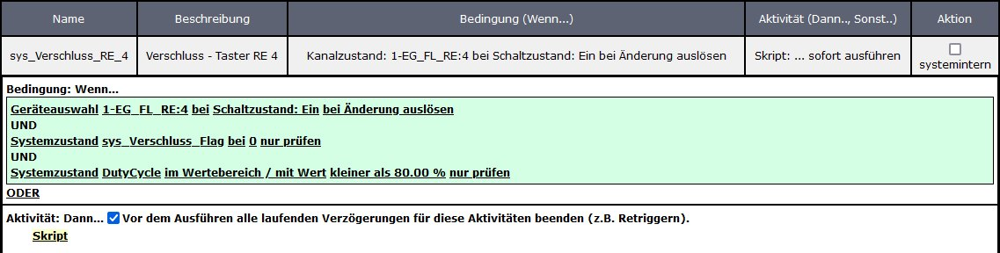

# WW-mySHP - HM-WM55_HM-MOD-Re-8 - Scripte

[Zurück zur Übersicht ...](../README.md)

[Zurück zu 'HM-WM55_HM-MOD-Re-8' ...](./README.md)

#### Allgemeines

Wie schon angemerkt, ist die Homematic-Zentrale ('CCU' oder 'RaspberryMatic') und das eingesetzte Homematic Modul 'HM-MOD-Re-8' nicht (unbedingt) für eine direkte und flotte Eventabarbeitung ausgelegt worden. Ein hohes Funkaufkommen wird mit einem hohen 'DutyCycle' bestraft, der letztlich bei 100% er Auslastung mit der Einstellung des Funkverkehrs zwischen Homematic Zentrale und Homematic Geräten bestraft wird.

So konnte auch in diesem Projekt nicht eine 'serielle/lineare Programmiereung' der eigentlich einfachen Aufgabenstellung 'zeige per LED an/aus, ob alle Verschlüsse einer Etage geschlossen sind' vorgenommen werden, da sie oft mit Geräte-Warnmeldungen des 'HM-MOD-Re-8' Moduls einher gingen. Die einzige Möglichkeit, die Homematic-Zentrale zu (zeitlich) definierten Funkaktionen zu zwingen, bestand darin, den Ablauf in mehrere Teil-Scripte zu zerlegen, die dann über das (zeitgesteuerte) Setzen einer Systemvariablen aufgerufen werden. So erreicht man eine gewisse Latenz (im Sekundenbereich), die dafür sorgt, dass das Abarbeiten der Funkbefehle nicht gestört wird. Da jeder LED-Schaltvorgang durch einen Funkbefehl ausgeführt wird, wurde bei der Programmierung darauf geachtet, die LED Ansteuerung so zu gestalten, dass nur 'notwendige' LEDs zur Anzeige gebracht werden.

Das WM55 Anzeigemodul unterteilt sich in die 'Rot / Grün' Ampeln für Erdgeschoss, Obergeschoss, Dachgeschoss und einer 'Hausampel'. Die Hausampel reagiert auf den sich öffnenden Türkontakt: sie signalisiert, ob alle Verschlüsse (bis auf den Türkontakt) geschlossen sind. Zusätzlich können über vier Taster am Anzeigemodul die jeweiligen Stati auch manuell abgerufen werden.

#### Funktion

Folgende Anzeige-Funktionen sind implementiert:

- Türkontakt öffnet
    - 'Hausampel' geht für ca. 1 sec auf 'Rot'
    - dann erfolgt die Verschlussprüfung für alle Verschlüsse bis auf den Verschluss des Türkontakts
    - Anzeige der Verschlussprüfung:
      - alle Verschlüsse sind geschlossen:
        - 'Hausampel' geht für ca. 5 sec auf 'Grün'
      - es sind nicht alle Verschlüsse geschlossen:
        - 'Hausampel' geht für ca. 5 sec auf 'Rot'
        - gleichzeitig geht die 'Geschossampel' ebenfalls für ca. 5 sec auf 'Rot', wo der Verschluss nicht geschlossen ist
  
- Taste für Erdgeschoss, Obergeschoss oder Dachgeschoss gedrückt
    - 'Geschossampel' geht für ca. 1 sec auf 'Rot'
    - dann erfolgt die Verschlussprüfung für das gewählte Geschoss
    - Anzeige der Verschlussprüfung:
      - alle Verschlüsse des Geschosses sind geschlossen:
        - 'Geschossampel' geht für ca. 5 sec auf 'Grün'
      - es sind nicht alle Verschlüsse des Geschosses geschlossen:
        - 'Geschossampel' geht für ca. 5 sec auf 'Rot'
  
- Taste für 'Hausampel' gedrückt
    - 'Hausampel' geht für ca. 1 sec auf 'Rot'
    - dann erfolgt die Verschlussprüfung  für alle Verschlüsse (incl. Türkontaktverschluss)
    - Anzeige der Verschlussprüfung:
      - alle Verschlüsse sind geschlossen:
        - jede 'Geschossampel' von Erdgeschoss, Obergeschoss oder Dachgeschoss geht für ca. 5 sec auf 'Grün'
      - es sind nicht alle Verschlüsse geschlossen:
        - 'Geschossampel', deren Verschlüsse alle geschlossen sind, geht für ca. 5 sec auf 'Grün'
        - 'Geschossampel', deren Verschlüsse nicht alle geschlossen sind, geht für ca. 5 sec auf 'Rot'

#### Systemvariablen

Folgende Systemvariablen müssen angelegt werden:

['sys_Verschluss' Systemvariablen ...](./bin/sys_Verschluss_Systemvariablen.txt)

#### Programme
Nach einem Türkontakt- bzw. Tasten-Event des 'HM-MOD-Re-8' Moduls setzen die 'sys_Verschluss' Script-Module zeitverzögert das Aktivitäts-Flag 'sys_Verschluss_Flag'. Über die Werte '0;T;X;Y;Z' werden die jeweiligen Ansteuer- und Auswerte-Scripte aufgerufen, die dann für das Ein- und Ausschalten der LEDs sorgen.

- [sys_Verschluss_RE_1](./bin/sys_Verschluss_RE_1.txt): 
  Event-Modul: wenn Taster 1 des 'HM-MOD-Re-8' Moduls auf 'Ein' geht
    
  
  [Script ...](./bin/sys_Verschluss_RE_1_Script.txt)
 
    
- [sys_Verschluss_RE_2](./bin/sys_Verschluss_RE_2.txt): 
  Event-Modul: wenn Taster 2 des 'HM-MOD-Re-8' Moduls auf 'Ein' geht
    
  
  [Script ...](./bin/sys_Verschluss_RE_2_Script.txt)
 
    
- [sys_Verschluss_RE_3](./bin/sys_Verschluss_RE_3.txt): 
  Event-Modul: wenn Taster 3 des 'HM-MOD-Re-8' Moduls auf 'Ein' geht
    
  
  [Script ...](./bin/sys_Verschluss_RE_3_Script.txt)
 
    
- [sys_Verschluss_RE_4](./bin/sys_Verschluss_RE_4.txt): 
  Event-Modul: wenn Taster 4 des 'HM-MOD-Re-8' Moduls auf 'Ein' geht
    
  
  [Script ...](./bin/sys_Verschluss_RE_4_Script.txt)
 
    
- [sys_Verschluss_RE_TK](./bin/sys_Verschluss_RE_TK.txt): 
  Event-Modul: wenn der Türkontakt auf 'Offen' geht
    
  
  [Script ...](./bin/sys_Verschluss_RE_TK_Script.txt)
 
    
- [sys_Verschluss_S_B](./bin/sys_Verschluss_S_B.txt): 
  Systemzustand: prüfen, ob gebootet wird - dann Status '0' initialisieren
    
  
    
- [sys_Verschluss_S_X](./bin/sys_Verschluss_S_X.txt): 
  Systemzustand: prüfen, ob Status 'X' (alle Verschlüsse prüfen und Status über LEDs anzeigen) gesetzt wurde
    
  
  [Script ...](./bin/sys_Verschluss_S_X_Script.txt)
  
    
- [sys_Verschluss_S_Y](./bin/sys_Verschluss_S_Y.txt): 
  Systemzustand: prüfen, ob Status 'Y' (nach 7 Sekunden alle LEDs ausschalten) gesetzt wurde
    
  
    
- [sys_Verschluss_S_Z](./bin/sys_Verschluss_S_Z.txt): 
  Systemzustand: prüfen, ob Status 'Z' (alle LEDs ausschalten) gesetzt wurde
    
  
  [Script ...](./bin/sys_Verschluss_S_Z_Script.txt)
  
    

#### Historie
- 2022-09-01 - Erstveröffentlichung
