# WW-mySHP - STALL-Weatherman

[Zurück zur Übersicht ...](../README.md)

#### Projekt-Beschreibung
xxx

[Original-Projekt zeigen ...](https://www.stall.biz/project/weatherman-die-perfekte-wetterstation-fuer-die-hausautomation)

[HomeMatic-Forum zeigen ...](https://homematic-forum.de/forum/viewtopic.php?t=38485)

#### Hardware
xxx

#### Konfiguration und Inbetriebnahme
xxx

#### Änderungen
xxx

#### Realisierung
xxx

  
- Stage 1 - Weatherman im RND-Gehäuse (RND 455-00223 oder RND 455-00144) mit abgesetztem AddOn Gehäuse für Lichtsensor BH1750 / NTC und Regensensor
  
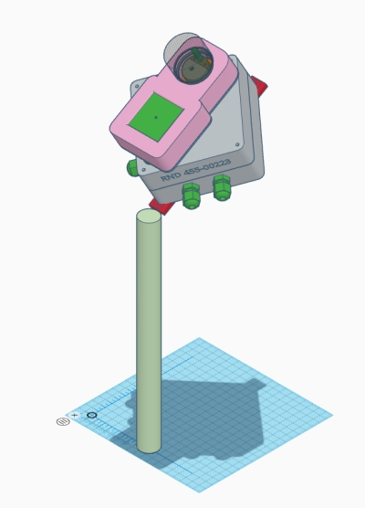
  
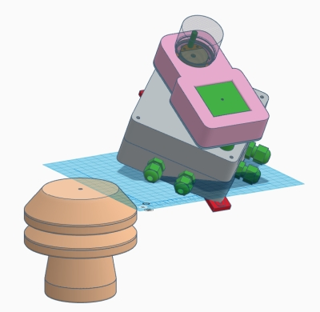
  

  
  - Detailansichten des RND AddOn Gehäuses für Lichtsensor BH1750 / NTC und Regensensor
  
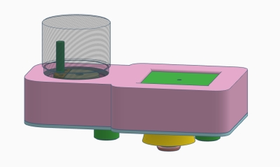
  
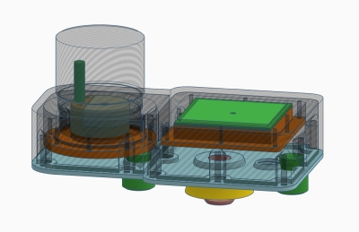
  
- Stage 2 - Weatherman im OBO T40 oder T60-Gehäuse mit separaten Gehäusen für Lichtsensor BH1750 / NTC, Regensensor und Wetterkappe YAWS
  
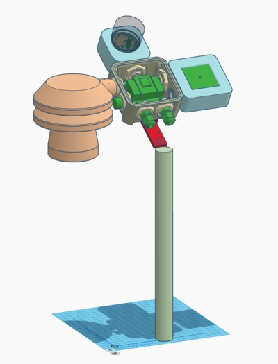
  
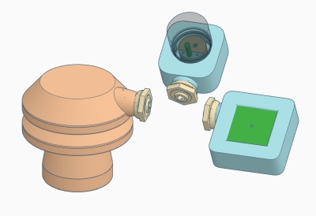
  
  - Detailansichten der Gehäuse für Lichtsensor BH1750 / NTC und Regensensor
  
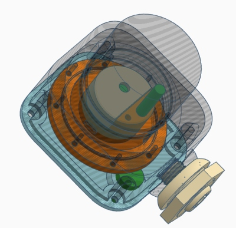
  
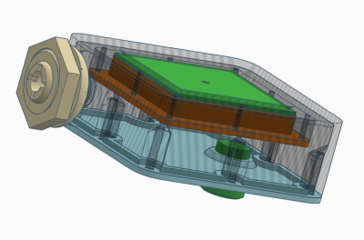
  
- Stage 3 - Weatherman im OBO T60-Gehäuse mit Wetterkappe YAWS und der 'STALL-Weatherman' Option
  
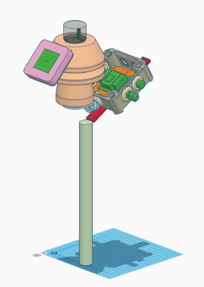
  
- Kombinationsmöglichkeiten für den Weatherman in Verbindung mit der 'YAWS-Toolbox'
  
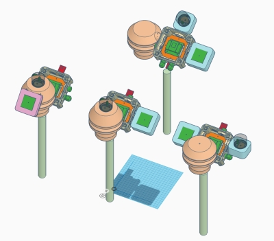
  
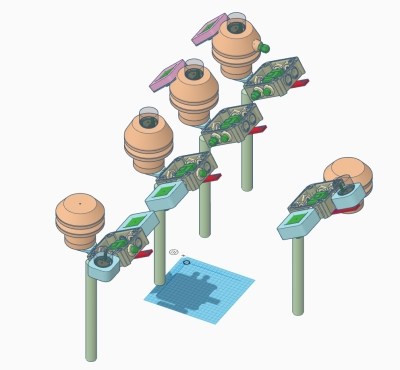

#### 3D-Print
- 3D-Druck Projekt für Gehäuse-Erweiterungen der Wetterstation 'STALL-Weatherman' - [Zeigen ...](https://github.com/wolwin/WW-my3DP/blob/master/3DP_Weatherman/README.md)
- 3D-Druck Projekt für 'YAWS-Tollbox' - [Zeigen ...](https://github.com/wolwin/WW-my3DP/blob/master/3DP_YAWS/README.md)

#### Historie
- 2020-xx-xx - Veröffentlichung an dieser Stelle
