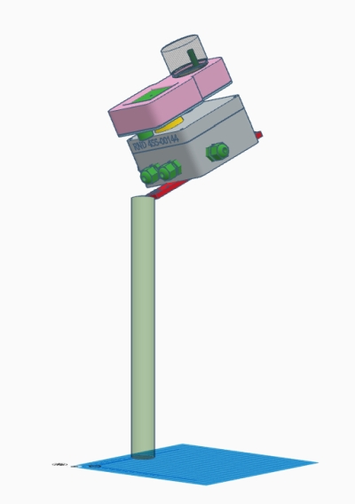

# WW-mySHP - STALL-Weatherman

[Zurück zur Übersicht ...](../README.md)

#### Projekt-Beschreibung
Beim 'STALL-Weatherman' handelt es sich um eine Selbstbau Wetterstation, die sich über eine WLAN Verbindung in die eigene Heimautomation einbinden läßt.

['STALL-Weatherman' Original-Projekt zeigen ...](https://www.stall.biz/project/weatherman-die-perfekte-wetterstation-fuer-die-hausautomation)

Support Unterstützung für den 'STALL-Weatherman' kann man im HomeMatic FHZ-Forum finden:

[Thread im HomeMatic FHZ-Forum zeigen ...](https://homematic-forum.de/forum/viewtopic.php?t=38485)

#### Hardware
Dr. Eugen Stall vertreibt über seinen Web-Shop einen Bausatz für den 'STALL-Weatherman'. Zusätzlich sind noch weitere Komponenten zu beschaffen, die auf der Projekt-Seite des Weatherman und in der Bauanleitung aufgeführt sind.

[Bausatz mit allen Teilen im Webshop 'www.stall.biz' ... und dort befindet sich auch der Link zur aktuellen Bauanleitung ...](https://www.stall.biz/produkt/weatherman-controller)

#### Konfiguration und Inbetriebnahme
Bei dem Aufbau des 'STALL-Weatherman' sollte man sich grundsätzlich eng an die in der Bauanleitung vorgegebenen Empfehlungen halten. Bei Schwierigkeiten kann man versuchen, über das FHZ-Forum Hilfe zu bekommen.

Die Inbetriebnahme des 'STALL-Weatherman' ist auf der Weatherman Projektseite beschrieben.

#### Erfahrungen und Bewertungen
Bei mir ist der 'STALL-Weatherman' seit über zwei Jahren in Betrieb. Der Erstaufbau erfolgte 'peinlich genau' entsprechend der Bauanleitung - außerdem wurden (Material-) Tipps aus dem FHZ-Forum (u.a. von Dr. Stall) direkt berücksichtigt. Von Beginn an habe ich den Aufbau und Betrieb bzw. die später vorgenommenen Hardware-Änderungen für mich dokumentiert. Zu Beginn war ich von der 'Einfachheit / Klarheit' des Konzeptes - das man relativ preiswert umsetzen konnte - begeistert. Auch die bereitgestellte Firmware tat was sie sollte - schnell und unauffällig standen die 'Wetterdaten' über WLAN zur Verfügung. Kleine Fehler oder JSON-Protokoll Erweiterungen - die man im FHZ-Forum melden konnte - wurden vom Autor verifiziert und beseitigt.
  
Alles gut also? Leider nicht ganz ...
 
- <b>Punkt 1</b> - Schwachpunkt ABS-Gehäuse: 
Für die Hardware kann ich nach zwei Jahren sagen, dass das 'integrative' Konzept der Sensoren in dem RND ABS-Gehäuse ohne weitere Maßnahmen zur Verhinderung von Feuchtigkeitsbildung im Gehäuse nicht funktioniert. Kabel ohne Kabeldurchführungen, hohe Temperaturunterschiede im Glas für den Sonnensensor und die Heizung der Regensensorplatine sehe ich persönlich als primäre Quellen der Feuchtigkeitsbildung. Ein zeitgleich aufgesetzter Feinstaub-Sensor in einem 'OBO-Betterman' T60 Gehäuse, das mit PTFE-Gehäuseschrauben und Kabeldurchführungen versehen wurde, weist nach zwei Jahren keine Feuchtigkeitsspuren auf! Weiter sind die Verklebungen der Weatherman Befestigungsschrauben zum RND Gehäuse alle abgelöst, obwohl der empfohlene 2-Komponentenkleber benutzt wurde. Die Verklebungen der Regensensorplatine und des Glases hatte ich sicherheitshalber schon nach einem Betriebsjahr mit UV-beständigem Silikon gesichert ...

- <b>Punkt 2</b> - Firmware: 
Aus meiner Sicht war das Konzept von Hardware und Software bis zur Firmware 67 stimmig, in der noch KEIN Datenlogger integriert war. Mit dem Einzug des Datenloggens, der Speicherung und Auswertung wurde aus meiner Sicht Features eingebracht, die für ein solches System nicht geeignet sind. Es wurde kein Mehrwert geschaffen - stattdessen zieht es sich wie ein roter Faden durch viele Kommentare im Weatherman-Thread des FHZ-Forums: Schwierigkeiten den Weatherman anzusprechen ... antwortet zeitweise nicht ... Verzögerungen ... Systemabstürze, Schwierigkeiten bei der WEB-Abfrage, usw. Ich selber benutze seit 04-2019 die Firmware 107 ( ... da leider in der Firmware 67 im JSON-Protokoll ein Parameter für meine NodeRed Umsetzung fehlt ...). Meine Rezessionen bzw. Kritik zu diesem Thema (... und ich war nicht der einzige, der diese Meinung vertrat ...) wurden von Dr. Stall dankend entgegengenommen - aber das war es dann auch. Inzwischen läuft die Feature-Manie weiter - derzeitiger Stand: 02.06.2020 - Firmware 147 ... für Leute, die experimentieren möchten eine reine Freude! Anwender, die verläßliche eigene Wetterdaten geliefert bekommen möchten, indiskutabel!

- <b>Punkt 3</b> - Dokumentation: 
Mit der größte Schwachpunkt ist jedoch, dass es keine Dokumentation darüber gibt, WAS geändert wurde oder WIE sich bestimmte Parameter-Einstellungen verhalten bzw. . Teilweise wurden Parameter-Einstellungen 'unter laufendem Rad' von der einen zur anderen Firmware-Version 'optimiert' - erfahren hat man das manchmal nur über Nachfragen der User im FHZ-Forum - quasi 'reverse engineering by observation' für jede neue Firmware. Auch: eine Liste der unterstützten Sensoren ... ab welcher Firmware ... welcher Sensor???

- <b>Punkt 4</b> - Kommunikation: 
Vielleicht kann man noch über einige Dinge (siehe Punkte 2 und 3) hinwegsehen und einfach an den Stellen optimieren, die man selber beeinflußen kann - es ist schließlich eine HOBBY-Anwendung. Jedoch hat mich folgende Aussage von Dr. Stall doch zweifeln lassen:

  - [Zitat - Link dazu ...](https://homematic-forum.de/forum/viewtopic.php?f=31&t=38485&hilit=jp112sdl&start=2940#p579895) :  
  <i>'Unsozial wie ich bin mache ich nur das was ich möchte und was mir Spaß macht und nicht, was andere von mir wollen!! :mrgreen: :mrgreen: :mrgreen: 
  ... und wenn andere Bastler die Module auch genauso wie ich haben wollen, dann können sie diese Teile gerne nachbauen. 
  Die aber was anderes haben wollen, sollen eben was anderes nachbauen oder, besser noch, selbst entwickeln. 
  Ist doch ganz einfach!</i>  

- <b>Zusammenfassung:</b> 
Das Projekt läuft unter dem Titel 'WEATHERMAN … die perfekte Wetterstation für die Hausautomation'. Das sehe ich SO nicht - ich denke, die Kritikpunkte sprechen für sich. Vor zwei Jahren war der Weg zu verläßlichen eigenen Wetterinformationen für die Heimautomation aus meiner Sicht fast vollständig erreicht - die Optimierung von wenigen Dingen hätten einen sehr guten Stand gebracht. Leider hat der Entwickler Dr. Stall einen anderen Weg eingeschlagen.

#### Änderungen und Realisierung
Um meinem Weatherman neues Leben einzuhauchen, habe ich mir die Punkte 'Gehäuse und Feuchtigkeit' vorgenommen. Über Stage 1, Stage 2 und Stage 3 habe ich drei unterschiedliche Lösungsansätze für den 'STALL-Weatherman' konstruiert: in allen drei Versionen wird das Weatherman Gehäuse und die Gehäuse für den Lichtsensor und die Regensensorplatine separiert und voneinander unabhängig betrieben sowie mit Hilfe von PTFE-Ventilationsschrauben belüftet.

Die maximal integrierte Version des 'STALL-Weatherman' (Stage 3) ist das OBO T60 Gehäuse mit Wetterkappe aus der ['YAWS-Toolbox' mit der 'STALL-Weatherman' Option](https://github.com/wolwin/WW-mySHP/blob/master/SHP_YAWS/README.md).

Da Nachfrage für eine OpenSource Version des Weatherman-Codes von Dr. Stall abgelehnt wird, kann leider eine Integration eines GEREGELTEN Lüfters in der 'YAWS-Wetterkappe' nicht (direkt) realisiert werden.

- <b>Stage 1</b> - Weatherman im RND-Gehäuse (RND 455-00223 oder RND 455-00144) mit abgesetztem AddOn Gehäuse für Lichtsensor BH1750 / NTC und Regensensor
  

  

  

  
  - Detailansichten des RND AddOn Gehäuses für Lichtsensor BH1750 / NTC und Regensensor
  

  

  
- <b>Stage 2</b> - Weatherman im OBO T40 oder OBO T60 Gehäuse mit separaten Gehäusen für Lichtsensor BH1750 / NTC, Regensensor und Wetterkappe YAWS
  

  

  
  - Detailansichten der Gehäuse für Lichtsensor BH1750 / NTC und Regensensor
  

  

  
- <b>Stage 3</b> - Weatherman im OBO T60 Gehäuse mit Wetterkappe YAWS und der 'STALL-Weatherman' Option
  

  
- Kombinationsmöglichkeiten für den Weatherman in Verbindung mit der 'YAWS-Toolbox'
  

  

#### 3D-Print
- 3D-Druck Projekt für Gehäuse-Erweiterungen der Wetterstation 'STALL-Weatherman' - [Zeigen ...](https://github.com/wolwin/WW-my3DP/blob/master/3DP_Weatherman/README.md)
- 3D-Druck Projekt der 'YAWS-Toolbox' - [Zeigen ...](https://github.com/wolwin/WW-my3DP/blob/master/3DP_YAWS/README.md)

#### Historie
- 2020-xx-xx - Veröffentlichung an dieser Stelle
