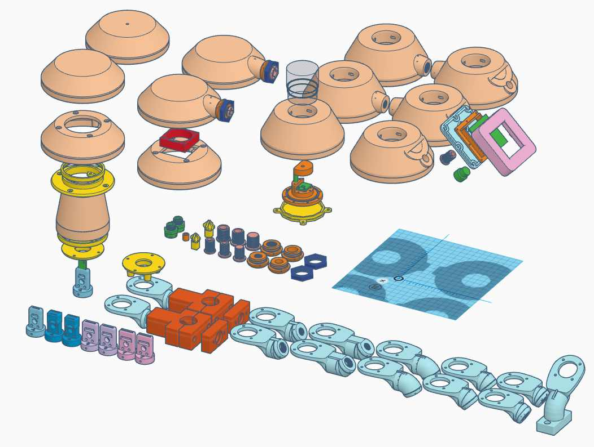

# WW-mySHP - YAWS - 'Yet Another Weather Shield' - Toolbox - Version 3

[Zurück zur Übersicht ...](../README.md)

### Projekt-Beschreibung
Es gibt viele Wetterkappen für unterschiedliche Sensoren - sowohl kommerziell als auch im OpenSource Bereich. Die Anzahl ist nahezu unüberschaubar. Im Rahmen meines ['STALL-Weatherman' Projektes](https://github.com/wolwin/WW-mySHP/blob/master/SHP_Weatherman/README.md) habe auch ich mich in den letzten zwei Jahren ebenfalls an dem Thema Wetterkappe versucht.

Meine persönlichen Erfahrungen münden nun mit der Version 3 in eine universelle Toolbox für Wetterkappen. Der Nutzer der Toolbox kann die Wetterkappe selber zusammenstellen. Mehrere verschiedene Sensorhalter, unterschiedliche Befestigungen der Kappe, mit oder ohne 40 mm Lüfteroption, sowie Insektenschutz der Sensorkammer, bis hin zur Integration des 'STALL-Weatherman' werden angeboten. Dabei wird die Konnektivität über die ['OBO-Toolbox'](https://github.com/wolwin/WW-my3DP/blob/master/3DP_OBO/README.md) hergestellt, sodaß der Anwender eigene Gehäuse - Wetterkappen Konfigurationen zusammenstellen kann.

### Realisierung
Ziel bei der Entwicklung der Wetterkappe war es, die Konstruktion so anzulegen, dass möglichst viele Optionen individuell miteinander kombiniert werden können. Gegenüber der Vorgängerversion wurde die Sensorkammer deutlich vergrößert. Die zwei ebenfalls vergößerten konischen Luftabführungen sorgen dafür, dass durch direkte Sonneneinstrahlung anfallende Wärme nach oben abtransportiert wird (als Option kann zusätzlich ein 40 mm Lüfter verbaut werden). Alle Gehäuseteile werden mit 'Blechschrauben DIN 7981 TX Edelstahl VA Linsenkopf 2,9 x 9,5 mm' verbunden.
  
Die Sensorkammer kann oben und unten mit einem Insektenschutz versehen werden - entsprechende Klemmringe fixieren die beiden Insektengitter an der Sensorkammer.
  
Der Sensorhalter platziert den Sensor mittig in der Sensorkammer. Der Halter wurde für Sensoren mit unterschiedlichen Anschlüssen / Bauformen und unterschiedlichen Dicken der Kabelzuführung (5 und 7 mm) ausgeführt: 1x4 Pin, 2x4 Pin, 1x5 Pin und 1x7 Pin. Die Fixierung des Zuleitungskabels erfolgt mittels Kabelbinder am Sensorhalter. Der Sensorhalter selber, läßt sich servicefreundlich durch das Lösen einer Fixierschraube aus dem Gehäuse nach unten entnehmen.
  
Ein wesentlicher Augenmerk wurde auf die Einbindung der Wetterkappe in die ['OBO-Toolbox'](https://github.com/wolwin/WW-my3DP/blob/master/3DP_OBO/README.md) gelegt. Alle Anschlüsse der Wetterkappen können mit den OBO-Gehäusen kombiniert werden - d.h.: eine 'YAWS-Wetterkappe' kann direkt über die eigenen M10- bzw. M12-Schraubverbinder an den OBO-Gehäusen angebracht werden. Da die Schraubverbinder hohl ausgeführt sind, ergibt sich zusätzlich die Möglichkeit, Kabel aus dem OBO-Gehäuse nach außen zu führen.
  
Das gleiche Schema wurde für externe Winkelschellen- und Mastbefestigungen (26 mm Durchmesser) gewählt. Damit sollte es möglich sein, die 'YAWS-Wetterkappe' gut an unterschiedlichen Stellen zu befestigen.
  
Für den 'STALL-Weatherman' wurden mehrere verschiedene Kombinationen von Sensor- und Befestigung geschaffen - in Verbindung mit der 'OBO-Toolbox' ergibt sich eine Vielfalt an Aufbaumöglichkeiten.
  
Eine Auswahl der Konfigurationsmöglichkeiten der 'YAWS-Wetterkappe' wird in der [Galerie](./README.md#Galerie) gezeigt ...

- 'YAWS-Toolbox' - Übersicht
  

  
- 'YAWS-Toolbox' - Standard
  - 4-Pin Sensorhalter (z.B. für BME280) mit 5 mm Kabel-Bohrung
  - Fixierringe für Insektenschutz
  - verdeckte Befestigungsbohrung (obere Kappe)
  

  

  
- 'YAWS-Toolbox' - Optionen - Beispiel
  - 4-Pin Sensorhalter (z.B. für BME280) mit 5 mm Kabel-Bohrung
  - Halterung für 40 mm Lüfter (Empfehlung: NOCTUA NF-A4x10 5V)
  - Fixierringe für Insektenschutz
  - seitlicher M10 Befestigungsanschluß (obere Kappe)
  

  

  
- 'YAWS-Toolbox' - Option 'STALL-Weatherman'
  - externe Fußhalterung mit M12 Schraubanschluß und 60 Grad Anschlußneigung
  - 4-Pin Sensorhalter (z.B. für BME280) mit 5 mm Kabel-Bohrung
  - Fixierringe für Insektenschutz
  - gekapselte Glaskuppel für Helligkeits- (BH1750) und Sonnentemperaturmessung (NTC-Fühler) mit PTFE-Membranschraube zum Feuchtigkeitsaustausch
  - seperates Regensensorgehäuse (beheizte Sensorplatine) mit PTFE-Membranschraube zum Feuchtigkeitsaustausch
  - Einbau der 40 mm Lüfter-Option ist gegeben (siehe oben - 'YAWS-Toolbox' - Optionen)
  

  

### 3D-Print
- 3D-Druck Projekt für 'YAWS-Toolbox' - [Zeigen ...](https://github.com/wolwin/WW-my3DP/blob/master/3DP_YAWS/README.md#stl-dateien)

### Hardware, Konfiguration, Aufbau und Inbetriebnahme
- siehe unter: [WW-my3DP - YAWS - Yet Another Weather Shield - Toolbox - Version 3](https://github.com/wolwin/WW-my3DP/blob/master/3DP_YAWS/README.md)

### Galerie
- 'YAWS-Toolbox' - Optionen - Beispiele
  

  
- 'YAWS-Toolbox' - Standard - Befestigung unten - Mastbefestigung (26 mm)
  

  
- 'YAWS-Toolbox' - Standard - Befestigung unten - Mastbefestigung (26 mm) über Winkel (EAN 004338333959) und Schelle (EAN 004338216634)
  

  
- 'YAWS-Toolbox' - Standard - Befestigung oben - Mastbefestigung (26 mm) über Winkel (EAN 004338333959) und Schelle (EAN 004338216634)
  

  
- 'YAWS-Toolbox' - Standard  - Befestigung oben - in Kombination mit Sonnen-Sensor-Gehäuse über Mastbefestigung (26 mm) - Kabelausleitung
  

  
- 'YAWS-Toolbox' - Standard  - Befestigung unten - in Kombination mit Regen-Sensor-Gehäuse über Mastbefestigung (26 mm)
  

  
- 'YAWS-Toolbox' - Option 'STALL-Weatherman'  - Befestigung unten - in Kombination mit OBO T60 Gehäuse
  

  

### Bilder
- 'YAWS-Toolbox' - Option 'STALL-Weatherman' (oben) und 'YAWS-Toolbox' - Standard mit Feinstaubsensor (unten)
- Stand 06-2020
    

### Historie
- 2020-07-02 - Vervollständigung Dokumentation
- 2020-06-07 - Veröffentlichung an dieser Stelle
